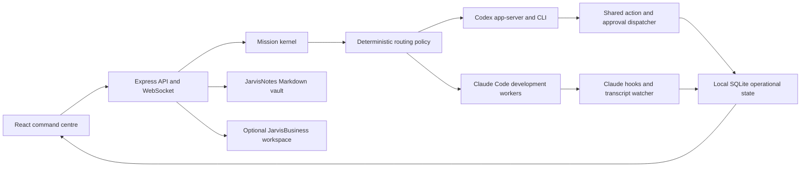

# Jarvis architecture

Jarvis is a local-first Agentic OS. It provides one mission, approval, scheduling, knowledge, and observability surface over signed-in Codex and Claude Code runtimes.

The historical Claude agent dashboard remains an execution and observability lane, not the product boundary.

## System shape



## Locked boundaries

- Codex is the durable mission owner for generic, personal, business, and development work.
- Development missions use Claude Code workers under a Codex-owned mission.
- Mini Jarvis uses Codex first for simple and standard work, Claude first for complex work, and only falls back between those signed-in subscription CLIs.
- No default route crosses into OpenAI or Anthropic API billing.
- Legacy API and local-model adapters may remain as dormant compatibility modules, but they are disabled in the example configuration and excluded from default routing.
- Jarvis owns permissions. A provider cannot bypass the shared action dispatcher.
- SQLite is operational state. Markdown is the portable personal and business record.
- The personal Windows checkout is the development authority after the migration gate passes; it is not automatically the production core.

## Mission kernel

The mission layer normalizes provider-native work without pretending the runtimes are identical.

Core records:

- `missions`: objective, domain, lifecycle state, owner provider, worker provider, model tier, host, and account metadata.
- `mission_events`: normalized status, text, tool, approval, artifact, and diagnostic events with redacted native payloads.
- `mission_links`: relationships between Jarvis missions and provider-native threads or sessions.
- `mission_approvals`: pending and resolved approval decisions.

`server/lib/mission-policy.js` chooses the default owner and worker. `server/lib/missions.js` persists lifecycle transitions and rejects disabled providers instead of silently choosing another one. `server/routes/missions.js` exposes the API used by desktop and mobile clients.

### Routing

| Domain | Owner | Worker | Access |
| --- | --- | --- | --- |
| Generic | Codex | Codex | Signed-in ChatGPT/Codex subscription |
| Personal | Codex | Codex roles | Signed-in ChatGPT/Codex subscription |
| Business | Codex | Codex business roles | Signed-in ChatGPT/Codex subscription |
| Development | Codex, with Sol for the mission envelope | Claude Code crew | Signed-in Codex and Claude subscriptions |

Explicit provider selection remains explicit and failures are reported. It is never used as an implicit billing fallback.

## Codex runtime

`server/lib/codex-app-server.js` manages one long-lived JSON-RPC stdio process. It multiplexes requests, validates the pinned protocol surface, redacts events before broadcast, reconnects active missions after restart, and keeps authentication in the installed Codex runtime.

`server/lib/codex-watcher.js` projects Codex task history into the existing session observability model. Imported history remains diagnostic context; the mission table remains the active command centre.

Supported mission lifecycle includes start, resume, steer, interrupt, retry, fork, archive, streamed output, structured questions, and approvals. `server/lib/codex-remote.js` uses supported CLI remote-control commands only.

## Claude Code development lane

Jarvis preserves Claude Code's hooks, transcripts, and project-scoped agents.

The authoritative development crew is:

| Agent | Purpose | Model tier |
| --- | --- | --- |
| Scout | Recon and evidence gathering | Haiku |
| Forge | Contained implementation | Sonnet |
| Sentinel | Risk-focused review | Opus |
| Ops | Commands, builds, tests, and process checks | Haiku |

Definitions live in `.claude/agents`. Codex does not duplicate these development roles under `.codex/agents`.

Claude hook events enter through `server/routes/hooks.js`. Session and sub-agent transcripts are imported by `server/scripts/import-history.js` and watched continuously. The dashboard keeps raw runtime identity and normalized Jarvis status together so diagnostics remain honest.

## Permissions and safety

`server/lib/assistant-actions/dispatcher.js` is the shared gate for dynamic actions.

- Safe actions may run from allowed non-interactive sources.
- Confirm actions require an interactive approval.
- Typed actions require the action name to be re-entered.
- Scheduled work cannot widen its own permissions.
- Pairing codes and credentials are not written to mission events or logs.
- Destructive business actions remain disabled unless explicitly implemented, configured, and approved.

The server binds to `127.0.0.1` by default. Non-loopback use requires authentication and an explicit trusted-host boundary.

## Storage

### Operational state

SQLite defaults to:

```text
%USERPROFILE%\.claude\agent-dashboard\dashboard.db
```

Resolution order:

1. `DASHBOARD_DB_PATH`
2. `DASHBOARD_DATA_DIR\dashboard.db`
3. the default Claude-home data directory above

The database uses WAL mode. Keep the `.db`, `-wal`, and `-shm` files together on local storage. Do not put them in iCloud, OneDrive, or the Git checkout.

### Portable knowledge

`JARVIS_NOTES_DIR` points to the Obsidian-compatible Markdown vault, normally `%USERPROFILE%\JarvisNotes`. Guarded write APIs capture durable notes while the vault watcher maintains links, entity metadata, recall state, and the graph index.

`JARVIS_BUSINESS_DIR` optionally points to `%USERPROFILE%\JarvisBusiness`. Business todos and briefings remain visibly separated from personal work. Marketplace integration configuration is local, redacted, and disabled by default.

### Project files

Project-file routes and MCP tools are constrained to configured project roots. Path containment is checked before reads or writes. Workspace access does not imply permission to publish, message, purchase, or delete.

## Server and client

The Node.js server owns:

- REST routes under `server/routes`
- orchestration and provider lifecycle under `server/lib`
- SQLite schema and prepared statements in `server/db.js`
- WebSocket broadcast in `server/websocket.js`
- production serving of `client/dist`

The React client owns presentation and user interaction. Important surfaces include Missions, Today, Run, Ops Room, Vault, Notes, Schedules, Briefings, Finance, Settings, and provider diagnostics. Development mode uses Vite; production mode serves the last built `client/dist` bundle.

## MCP

The `mcp` workspace exposes bounded Jarvis operations over stdio or HTTP. It calls the same dashboard APIs and therefore inherits their path, permission, and authentication checks. Stdio logs go to stderr so protocol output remains valid.

## Scheduling

Jarvis is the schedule authoring and control plane. Schedules persist the intended mission action, overlap policy, missed-run policy, retry limit, execution timeout, sandbox choice, and notification behavior. Read-only is the default. Schedule execution does not grant new tool authority.

Runtime profiles add a second, server-side boundary. `development-local` may author and inspect rows, but it does not arm schedule timers, send native/web push, deliver webhooks, or run recurring GitHub/Monday callbacks. `worker-personal` is likewise non-authoritative. `production-company-core` remains locked unless the later core host explicitly sets `JARVIS_ENABLE_PRODUCTION_CORE=1`.

## Background services

The server starts bounded maintenance services for:

- Claude hook discovery and session synchronization
- Codex mission reconnection and watcher updates
- workflow and transcript ingestion
- stale-session recovery
- notifications, schedules, briefings, and alert sweeps
- vault watching and derived indexes

Background failures are surfaced in diagnostics and should not block hook ingestion.

## Deployment boundary

The supported shape is one trusted Jarvis core with browsers connecting locally or through authenticated Tailscale HTTPS. Multiple active cores must not share one SQLite database. Development uses a separate disposable local database; future worker nodes execute bounded tasks without becoming another source of operational truth.

See [SETUP.md](SETUP.md), [DEPLOYMENT.md](DEPLOYMENT.md), and [docs/AGENTIC-OS.md](docs/AGENTIC-OS.md).

## Verification map

| Change | Minimum verification |
| --- | --- |
| Server or database | `npm.cmd run test:server` |
| Client | `npm.cmd run test:client` and `npm.cmd run build` |
| MCP | `npm.cmd run test:mcp`, `npm.cmd run mcp:typecheck`, `npm.cmd run mcp:build` |
| Agent roster | `node --test server/__tests__/agent-roster.test.js` |
| Provider policy | `node --test server/__tests__/mission-policy.test.js` |

Before a release or migration gate, run all of the above and verify `GET /api/health` from the serving process.

## Attribution

Jarvis retains the Git history and MIT attribution of Claude-Code-Agent-Monitor. Current product direction and later Agentic OS work are maintained as Jarvis rather than presented as the historical upstream dashboard.
