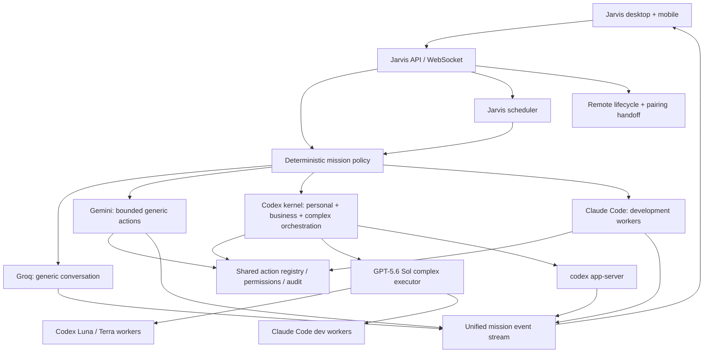

# Agentic OS — Codex-Native Master Plan

**Status:** Implemented 2026-07-14
**Written:** 2026-07-14
**Primary objective:** Restore Jarvis Dashboard to a polished, Codex-native Agentic OS that unifies Codex, Claude Code, Groq, and Gemini without turning the product into a collection of provider-specific consoles.

This plan supersedes the old assumption that Jarvis is primarily a Claude Code monitoring dashboard. Existing Claude monitoring remains valuable, but it becomes one execution lane inside a Codex-led operating system.

---

## 1. North star

Jarvis should feel like one intelligent operating system:

- one command surface;
- one mission/task model;
- one approvals and permissions system;
- one timeline and operations room;
- one mobile remote surface;
- one scheduler;
- several carefully bounded execution engines underneath.

The user should think in terms of **Personal**, **Development**, and **Business** missions—not ChatGPT, Claude, Groq, or Gemini apps. Provider and model badges remain visible for trust, billing clarity, and debugging, but they are implementation details rather than the navigation model.

The product feeling is “JARVIS / Tony Stark”: calm, concise, capable, state-aware, and visually alive. It must not become theatrical at the expense of reliability. Every animation and status phrase should reflect real execution state.

---

## 2. Locked product decisions

These are defaults, not suggestions:

1. **Codex is the OS kernel.** New personal and business missions are created, resumed, steered, approved, observed, and scheduled through Codex-native task primitives wherever the supported interface allows it.
2. **GPT-5.6 Sol is the complex executor.** Large, ambiguous, risky, or multi-step missions are owned by Sol. Sol decomposes work and delegates bounded sub-tasks to cheaper/faster workers rather than doing every token of work itself.
3. **Development agents stay on Claude Code.** Codex/Sol may classify, plan, supervise, and summarize a development mission, but implementation, repository exploration, testing, and code review workers run through the official Claude Code CLI and its agent definitions.
4. **Business agents run on Codex.** Business agent definitions and execution move to Codex. Claude is not the default or fallback for business work.
5. **Personal agents run on Codex.** Groq and Gemini can answer or act at the front door, but durable/autonomous personal missions belong to Codex threads.
6. **Groq handles generic conversation.** Use it for low-risk, non-durable conversation that does not need tools, deep reasoning, private project history, or an autonomous run.
7. **Gemini handles generic actions.** Use it for low-risk, bounded tool requests such as opening a browser tab, navigating to a URL, lightweight extraction, and other actions already exposed through Jarvis’s shared action registry.
8. **All tools pass through Jarvis permissions.** No provider-native tool call may bypass the shared dispatcher, confirmation rules, audit log, or allowlist.
9. **Subscription-backed access stays distinct from API billing.** Codex and Claude Code use their official signed-in subscription-backed CLIs. Groq/Gemini use their explicitly configured credentials and quotas. There is no silent OpenAI or Anthropic API fallback.
10. **Routing is deterministic first.** A small policy engine selects a lane and model tier using intent, domain, risk, context size, and execution state. Sol is not called merely to decide whether Sol is needed.
11. **No silent provider fallback.** If a required provider is unavailable, Jarvis explains the boundary and offers a visible alternative. It never quietly converts subscription use into API spend.
12. **Markdown remains the portable state of record.** Business and personal knowledge stays in `~/JarvisBusiness` and `~/JarvisNotes`; the dashboard database is an index and operational cache, not the only copy of important state.

---

## 3. Supported-platform boundaries

The implementation must reflect what the official products actually expose.

### Codex app-server

Use the stable `codex app-server` JSON-RPC protocol as Jarvis’s native Codex control plane. It supports the task lifecycle Jarvis needs: starting, resuming, forking, steering, interrupting, approving, and streaming task/item events.

- Run app-server behind the Jarvis backend over stdio.
- Keep browser/mobile clients connected to Jarvis’s authenticated API and WebSocket, not directly to an experimental Codex socket.
- Generate and pin protocol schemas from the installed Codex CLI during implementation.
- Preserve the existing Codex adapter and extend it; do not introduce the Codex SDK merely to duplicate a working integration.

### Native Codex Remote

Native Remote and the mobile ChatGPT client use a secure OpenAI relay that is not a public custom-client API. Jarvis will not reverse-engineer it.

Jarvis should support two complementary remote paths:

1. **Jarvis Mobile Remote:** the mobile dashboard controls native Codex tasks through Jarvis backend → app-server. It provides start, resume, steer, interrupt, approvals, status, diffs/artifacts, and notifications.
2. **Native Remote handoff:** Jarvis can start/stop Remote, show status, create a short-lived pairing code, and hand the user to the supported native Remote experience for capabilities only available there.

If OpenAI later publishes a supported relay/client API, add it behind a capability adapter. Do not design the core around that possibility.

### Native scheduled tasks

Native scheduled-task management currently belongs to the ChatGPT desktop/web surface and requires the desktop app and an awake machine for local work. There is no supported general CLI CRUD interface Jarvis should pretend exists.

Therefore:

- keep Jarvis’s existing persistent scheduler as the authoring and control plane;
- execute scheduled Codex work through native Codex threads/app-server;
- add a visible handoff/deep link to native Scheduled tasks where useful;
- add a native scheduler adapter only when an official management API exists.

### Claude Code

Use only the official Claude Code binary and its supported session/agent mechanisms for the Development lane. Do not extract or reuse Claude OAuth credentials, and do not route generic chat or business work through Claude Code simply because it is available.

---

## 4. Target architecture



### Architectural rule

Providers implement capabilities. They do not own product behavior. Mission lifecycle, permissions, scheduling, notifications, storage, and presentation stay provider-neutral.

---

## 5. Domain and model policy

| Mission type | Owner | Default worker | Escalation | Notes |
|---|---|---|---|---|
| Generic conversation | Groq | configured lightweight Groq model | Codex Luna when context/durability is required | Never create a durable autonomous mission for small talk |
| Generic bounded action | Gemini | configured Gemini tool model | Codex Luna/Terra for multi-step action; Sol for complex cross-app work | Every action uses the shared registry |
| Personal mission | Codex | Luna | Terra, then Sol | Persist important outputs to the vault |
| Business mission | Codex | Luna or Terra | Sol | Business roster is Codex-native |
| Development mission | Codex supervisor + Claude Code workers | Claude Haiku/Sonnet by role | Claude Opus for hard review/architecture; Sol retains mission ownership | Code-changing workers remain Claude Code |
| Large/complex mixed mission | Codex Sol | Luna/Terra or Claude workers | Sol performs unresolved critical steps | Maximum one orchestration layer initially |

### Semantic model tiers

Application policy should name semantic tiers rather than scattering provider slugs throughout the code:

- `fast`: Groq generic chat, Codex Luna, Claude Haiku;
- `standard`: Codex Terra, Claude Sonnet, appropriate Gemini action model;
- `executor`: GPT-5.6 Sol or the highest available GPT-5.6 executor capability;
- `deep_review`: Claude Opus for development review only, or Sol outside development.

At startup, each provider reports available model IDs. The resolver maps semantic tiers to currently available IDs and clearly marks substitutions. If `gpt-5.6-sol` is available, it is the executor. If the installed Codex surface exposes a different GPT-5.6 executor name, resolve it explicitly and show that mapping in Settings/Diagnostics.

### Deterministic routing sequence

1. Determine domain: `personal`, `development`, `business`, or `generic`.
2. Determine interaction: `conversation`, `bounded_action`, `durable_mission`, `scheduled_mission`, or `continuation`.
3. Determine complexity and risk from observable features: requested tools, expected steps, files/repos involved, context size, destructive actions, ambiguity, and whether multiple workers are useful.
4. Apply domain ownership rules.
5. Select the lowest tier that can complete the work reliably.
6. Escalate only on an explicit signal: worker failure, unresolved ambiguity, risky decision, exceeded scope, or user request.
7. Record the decision and reason on the mission timeline.

User model selection remains an override, subject to provider availability and permissions.

---

## 6. Sol orchestration contract

Sol is an executor-orchestrator, not a universal chat model.

For a complex mission Sol should:

1. retain the user goal, constraints, decisions, and final accountability;
2. split work into independent, bounded assignments;
3. choose workers by domain and cost policy;
4. give each worker only the context it needs;
5. require structured results containing outcome, evidence, changed artifacts, validation, risks, and recommended next action;
6. reconcile conflicting results;
7. execute the irreducibly complex/risky step itself;
8. produce the final unified answer and update durable state.

Initial efficiency limits:

- maximum orchestration depth: `1`;
- maximum concurrent child tasks: `4`;
- one code-writing worker per worktree;
- no parallel workers editing the same files;
- child timeout and turn budget required;
- no full child transcripts injected into Sol context—use structured summaries and artifact links;
- promote Luna → Terra → Sol only when a concrete escalation condition fires;
- promote Claude Haiku → Sonnet → Opus only inside the Development lane.

---

## 7. Unified mission model

Reuse the existing sessions/runs/agents database where practical. Generalize it rather than creating a second orchestration database.

Every visible task should expose a provider-neutral mission envelope:

```text
mission_id
title
domain                 personal | development | business | generic
interaction            conversation | action | mission | schedule
status                 queued | planning | delegated | running | waiting_approval |
                       blocked | completed | failed | cancelled
owner_provider          codex | claude-code | groq | gemini
owner_model_tier        fast | standard | executor | deep_review
native_thread_id
parent_mission_id
workspace
origin                  desktop | mobile | schedule | remote | api
approval_policy
sandbox_policy
started_at / updated_at / completed_at
usage_summary
result_summary
artifact_links
```

Add only the columns/relations needed to the current schema. A small mission-link table is acceptable for parent/child/provider-native IDs if forcing them into current columns becomes brittle.

Normalize provider events into a shared vocabulary while retaining the original event payload for diagnostics. The UI should be able to render a Codex turn, Claude hook event, Gemini action, or Groq response on one timeline without pretending they are identical internally.

---

## 8. Agent rosters

### Personal — Codex

Create a small Codex roster only when a persistent role improves results. Avoid an agent for every feature.

- personal-ops: routine organization and follow-through;
- researcher: evidence gathering and synthesis;
- vault-curator: writes approved durable output to the vault inbox;
- Sol supervisor: complex or cross-domain missions.

### Development — Claude Code

Keep `.claude/agents` authoritative for development workers and normalize their model assignments:

- scout/diagnostic: Haiku where sufficient;
- implementer: Sonnet by default;
- reviewer/tester: Sonnet, with Opus escalation for architecture, security, or unresolved defects;
- release/ops: the lowest reliable Claude tier for the bounded task.

Codex owns the Jarvis mission envelope and may ask Claude Code workers to execute. Claude session IDs, hook events, changed files, test results, and summaries return to the same mission timeline.

### Business — Codex

Move the authoritative business roster to `~/JarvisBusiness/.codex/agents/*.toml`:

- deal-scout;
- underwriter;
- listing-writer;
- cs-drafter;
- bookkeeper;
- ops-manager.

During migration, existing `.claude/agents` business definitions may remain read-only as comparison/fallback artifacts. Remove or mark them legacy after output parity is confirmed. Business state continues to live in Markdown, not provider chat history.

---

## 9. Delivery phases

Each phase should land as one or more small, reversible commits. Do not combine unrelated UI polish, database migration, and provider behavior in one commit.

### Phase 0 — Stabilize and name the new direction

**Purpose:** prevent existing Codex work-in-progress and the old Claude-first project description from fighting the migration.

Work:

- inventory and separately land or quarantine the existing untracked Codex adapter/watcher/session changes;
- update `AGENTS.md` project intent from “Claude Code monitoring platform” to “Codex-native Agentic OS with a Claude Code development lane”;
- add an architecture decision record containing the locked decisions in this plan;
- establish feature flags: `codex_kernel`, `unified_missions`, `mobile_codex_remote`, and `codex_schedules`;
- capture baseline behavior and database backup procedure.

Acceptance:

- existing Claude monitoring still works;
- current tests pass apart from documented unrelated failures;
- Codex WIP is represented in intentional commits, not an untracked dependency.

### Phase 1 — Codex kernel and lifecycle supervisor

**Primary files:** `server/lib/providers/agent/codex.js`, `server/lib/providers/agent/index.js`, `server/lib/run-spawner.js`, new focused app-server supervisor module, diagnostics routes.

Work:

- make `codex` the default mission provider while preserving explicit provider selection;
- turn the current app-server adapter into a managed, long-lived backend service rather than one process per incidental call where possible;
- support thread start/resume/fork, turn start/steer/interrupt, approvals, and streamed item events;
- persist the native Codex thread ID and reconnect/resume after dashboard restart;
- generate protocol schemas from the installed CLI and validate inbound/outbound messages;
- add health state: CLI found, authenticated, app-server ready, supported methods, model capabilities, Remote status;
- retain CLI subprocess fallback only for a clearly documented degraded mode.

Acceptance:

- a Codex mission can start, stream, survive a dashboard restart, resume, be steered, be interrupted, and request/receive approval;
- app-server failure is visible and recoverable;
- no OpenAI API key is required or consumed.

### Phase 2 — Mission policy and provider boundaries

**Primary files:** `server/lib/brain/router.js`, `server/lib/assistant-actions/index.js`, provider registry/config, Settings/Diagnostics UI.

Work:

- replace provider-order routing with the domain/interaction/complexity policy in this plan;
- introduce semantic model-tier resolution and provider capability discovery;
- encode the Personal/Development/Business ownership rules;
- keep Groq as generic conversation and Gemini as bounded action specialist;
- enforce “no silent fallback” and expose routing reasons;
- centralize billing/auth labels: `subscription_cli`, `api_metered`, or `unavailable`;
- send every action through the common registry and permission dispatcher;
- add provider kill switches and quotas without changing mission ownership silently.

Acceptance:

- routing fixtures cover every row in the domain/model table;
- generic chat does not invoke Sol;
- open-browser requests choose Gemini plus the gated action;
- development workers choose Claude Code;
- business and durable personal missions choose Codex;
- unavailable credentials produce an explicit, actionable error.

### Phase 3 — Sol delegation and autonomous execution

**Primary files:** run spawner, agent registry, mission-link storage, Codex agent configs, Claude Code bridge.

Work:

- implement the Sol orchestration contract and its hard efficiency limits;
- expose worker selection as policy, not free-form provider guessing;
- add structured child-task briefs and structured completion reports;
- support Codex subagents for personal/business children;
- support Claude Code child sessions for development assignments;
- isolate code-writing workers with worktrees when multiple development assignments exist;
- aggregate usage by mission, provider, model tier, and child;
- add cancellation propagation and partial-result recovery.

Acceptance:

- one complex mixed mission can delegate a research/business child to Codex and a code child to Claude Code, then return one reconciled result;
- the parent remains steerable while children run;
- limits prevent runaway depth, fan-out, or parallel file conflicts;
- failed children do not erase successful partial results.

### Phase 4 — Unified observability and controls

**Primary files:** `server/lib/codex-watcher.js`, sessions/agents/events routes, `client/src/pages/Dashboard.tsx`, `client/src/components/AgentRoom.tsx`, transcript/timeline components.

Work:

- make watcher/import and live app-server events feed the same normalized mission stream;
- show Codex tasks, Claude workers, Groq conversations, and Gemini actions in Ops Room;
- distinguish mission owner from delegated worker;
- provide common controls: steer, approve/deny, interrupt, retry, fork, archive, and open artifact;
- retain provider-native diagnostics behind an expandable detail view;
- show real usage/latency estimates and the reason for model escalation;
- remove Claude-only terminology from shared UI and APIs.

Acceptance:

- current and imported Codex tasks appear with transcript/events and controls;
- Claude Code workers appear beneath their owning development mission;
- provider badges are accurate but do not fragment navigation;
- controls disable themselves when the underlying provider lacks that capability.

### Phase 5 — Mobile remote, native Codex control, and handoff

**Primary files:** mobile routes/components, `MobileTabBar.tsx`, WebSocket/push modules, new Remote lifecycle adapter and routes.

Work:

- make the mobile task screen a responsive client of the same mission API used on desktop;
- support start/resume/steer/interrupt/approve/deny and live output for Codex tasks via app-server;
- add host Remote controls: status, start, stop, and short-lived `pair --json` pairing code;
- display pairing expiry and never log/store the code after expiry;
- add a supported handoff/deep link to native Codex Remote/ChatGPT for relay-only capabilities;
- send push notifications for approval requests, completion, failure, and scheduled-run start;
- require existing Jarvis authentication/Tailscale boundaries for dashboard remote access;
- preserve a compact Today and Scheduled view for mobile.

Acceptance:

- from a phone, the user can continue and steer a running Codex mission, answer an approval, and receive completion notification;
- pairing creates a valid, expiring native Remote code without exposing credentials;
- loss of the mobile connection does not terminate the task;
- no undocumented OpenAI relay protocol is used.

### Phase 6 — Scheduling as first-class missions

**Primary files:** `server/lib/scheduler.js`, `server/routes/schedules.js`, `client/src/pages/Scheduled.tsx`, mission policy and notifications.

Work:

- extend existing schedules with domain, owner provider, semantic model tier, workspace, agent role/roster, approval policy, sandbox policy, thread strategy, and notification policy;
- default personal/business schedules to Codex and development schedules to Codex-owned missions with Claude Code workers;
- run schedules through the same policy and mission lifecycle as interactive requests;
- support `new_thread`, `resume_thread`, and `steer_active` explicitly;
- enforce narrow sandboxing and non-interactive approval rules for unattended work;
- add missed-run, overlap, retry, timeout, and concurrency policies;
- show next run, last result, current mission, child workers, and resource usage;
- provide an optional “Open native Scheduled tasks” handoff, clearly labeled as a separate native surface.

Acceptance:

- one-time and recurring Codex missions survive dashboard restart and execute once as intended;
- a scheduled development mission launches the correct Claude Code worker under a Codex mission owner;
- overlapping schedules follow the configured policy;
- unattended work cannot silently broaden permissions;
- schedule history links to the full mission timeline.

### Phase 7 — Business and personal migration

Work:

- create and validate the Codex personal and business agent definitions;
- migrate business roster ownership from `.claude` to `.codex` in a staged comparison;
- update business workflows so artifacts and decisions write to `~/JarvisBusiness` and vault inbox through approved actions;
- migrate recurring personal routines to Codex schedules;
- build a one-time view of old Claude sessions so they remain searchable without remaining the default execution path.

Acceptance:

- all six business roles can be launched and scheduled as Codex agents;
- business output remains portable Markdown;
- no business task routes to Claude unless the user explicitly overrides policy;
- legacy Claude history stays readable.

### Phase 8 — JARVIS experience and product polish

Work:

- reorganize the main experience around Command Center, Missions, Ops Room, Today, Scheduled, Vault, and Settings;
- add truthful HUD states: listening, understanding, planning, delegating, executing, waiting for approval, blocked, and ready;
- create a restrained “arc reactor” system indicator driven by real health/mission state;
- use Personal/Development/Business lanes and mission outcome cards instead of provider tabs;
- make escalation visible as a concise event: “Promoted to Sol: multi-repository change and conflicting constraints”;
- add quiet mode, reduced motion, keyboard command palette, and mobile-friendly controls;
- standardize JARVIS voice: short, confident status first; detail on demand.

Acceptance:

- the home screen answers: what is running, what needs me, what finished, what is next, and whether the system is healthy;
- no core workflow requires visiting a provider-specific page;
- every visual state corresponds to real backend state;
- desktop and mobile share concepts and controls.

### Phase 9 — Hardening and default-on rollout

Work:

- run server/client/MCP tests and add lifecycle, routing, schedule, permissions, restart, and migration coverage;
- test provider outages and authentication expiry without paid live model calls where fixtures suffice;
- add database migration rollback and backup verification;
- threat-model remote pairing, approvals, prompt/action injection, and stored credentials;
- measure mission success, Sol escalation rate, child fan-out, time-to-first-status, mobile reconnect time, and schedule reliability;
- enable features in order: Codex kernel → unified missions → routing → mobile → schedules → business migration;
- remove obsolete Claude-first defaults only after parity gates pass.

Acceptance:

- Codex is the default for new missions;
- Development, Personal, and Business policy tests are deterministic;
- no subscription/API billing boundary is ambiguous in UI or logs;
- rollback can restore the prior dashboard without losing mission history.

---

## 10. API and storage changes

Prefer extending existing endpoints with provider-neutral resources. Proposed surface:

- `GET /api/missions`
- `POST /api/missions`
- `GET /api/missions/:id`
- `POST /api/missions/:id/steer`
- `POST /api/missions/:id/interrupt`
- `POST /api/missions/:id/approval`
- `POST /api/missions/:id/fork`
- `GET /api/missions/:id/events`
- `GET /api/providers/capabilities`
- `GET /api/codex/remote/status`
- `POST /api/codex/remote/start`
- `POST /api/codex/remote/stop`
- `POST /api/codex/remote/pair`

Existing `/api/runs`, sessions, agents, and schedule endpoints should remain during migration and delegate internally to the new mission service where possible. Avoid a flag-day client rewrite.

WebSocket events should use a shared envelope such as:

```json
{
  "type": "mission.event",
  "missionId": "...",
  "provider": "codex",
  "event": "waiting_approval",
  "at": "...",
  "summary": "Permission required to modify three files",
  "native": {}
}
```

Sensitive provider payloads must be redacted before broadcasting to clients.

---

## 11. Security, permissions, and billing gates

- Store credentials only in the existing secure provider configuration path; never persist native Remote pairing codes.
- Treat model text as untrusted input to the action dispatcher.
- Require explicit confirmation for destructive, financial, publishing, messaging, or broad computer-control actions.
- Scheduled work defaults to the narrowest sandbox and a no-surprise approval policy. If it cannot complete unattended safely, it pauses and notifies.
- Development worktrees isolate concurrent writers; the main checkout is never implicitly modified by several workers.
- Display the access type beside every provider: subscription-backed CLI or metered API.
- Track estimated usage by mission and child, but do not fabricate monetary cost where the provider does not expose it.
- Log routing, escalation, approval, action, and handoff decisions in a human-readable audit trail.

---

## 12. Testing strategy

Use fixtures and fake provider transports for most validation.

Required suites:

- routing table and explicit override tests;
- model capability/resolution tests;
- app-server protocol and reconnect tests;
- mission normalization tests across all four providers;
- Sol fan-out, limits, cancellation, and partial-failure tests;
- shared action-permission tests proving no provider bypass;
- scheduler restart, overlap, missed-run, and approval tests;
- mobile WebSocket reconnect and approval tests;
- Remote lifecycle/pairing redaction tests;
- database migration and legacy session compatibility tests;
- UI state tests for every mission status.

Use paid/live provider tests only as small, explicit smoke checks after fixture coverage passes. Do not make normal CI depend on live subscriptions or API credits.

---

## 13. Success measures

The migration is successful when:

- at least 90% of new durable personal/business work starts as a Codex mission;
- generic chat and bounded actions avoid Sol unless escalation is justified;
- every development worker is a traceable Claude Code child of a Jarvis mission;
- every business agent is Codex-native;
- a user can control and approve a Codex mission from mobile without opening the desktop provider app;
- scheduled missions survive restart and link to auditable results;
- provider/model choice and billing boundary are visible for every mission;
- the user can answer “what is Jarvis doing?” from one screen in under five seconds.

---

## 14. Deliberate non-goals

- rebuilding the native ChatGPT/Codex Remote relay;
- scraping provider UIs or reusing subscription credentials as unofficial APIs;
- moving all state into the dashboard database;
- using Sol for every message;
- creating a custom orchestration framework where Codex threads/subagents and the current run spawner already suffice;
- forcing provider parity where a provider does not support a capability;
- replacing Claude Code for development agents without a later explicit product decision;
- adding voice, avatars, or cinematic effects before mission lifecycle and mobile reliability are solid.

---

## 15. Recommended implementation order

The shortest safe path to the product goal is:

1. land and stabilize the existing Codex adapter;
2. make app-server lifecycle reliable;
3. introduce provider-neutral missions and deterministic domain routing;
4. make current Codex tasks visible and controllable in Ops Room;
5. add Sol delegation with Claude Code development children;
6. upgrade mobile controls and native Remote handoff;
7. route schedules through the mission layer;
8. migrate business agents to Codex;
9. complete the JARVIS visual/interaction pass;
10. enable Codex-native defaults and remove obsolete Claude-first assumptions.

This order produces useful integration early, preserves existing monitoring during migration, and delays aesthetic work until the displayed state is trustworthy.

---

## 16. Platform references used for this plan

- [Codex App Server](https://learn.chatgpt.com/docs/app-server)
- [Codex subagents](https://learn.chatgpt.com/docs/agent-configuration/subagents)
- [Scheduled tasks](https://learn.chatgpt.com/docs/automations)

Re-check these boundaries at the start of the relevant implementation phase because Codex product capabilities are evolving quickly.
