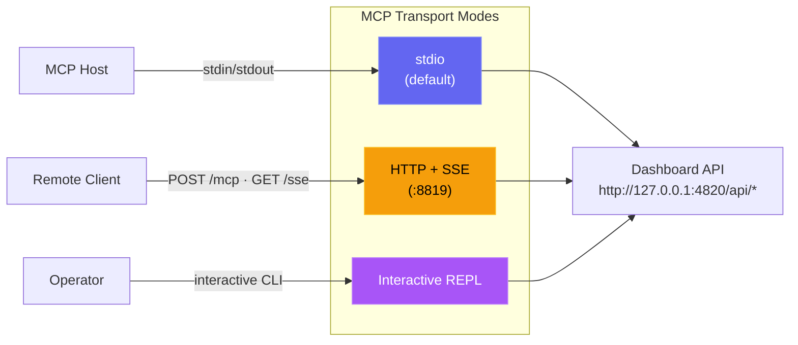
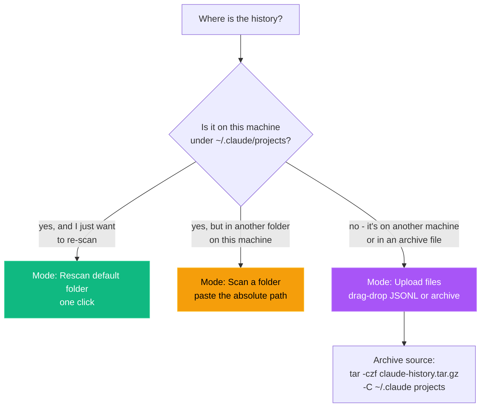

# Setup Guide

A comprehensive guide to setting up and configuring the Agent Dashboard, including how it integrates with Claude Code, environment variables, container deployment, and troubleshooting common issues.

## How it works

Agent Dashboard integrates with Claude Code through its native hook system. When Claude Code performs any action (session start, tool use, turn completion, subagent finish, session exit), it fires a hook that calls a small Node.js script bundled with this project. That script forwards the event over HTTP to the dashboard server, which stores it in SQLite and broadcasts it to the browser over WebSocket.

```
Claude Code  →  hook fires  →  hook-handler.js  →  POST /api/hooks/event
                                                         ↓
Browser  ←  WebSocket broadcast  ←  Express server  ←  SQLite
```

No extra Claude Code configuration is required in the normal host-run path - when you start the dashboard with `npm run dev` or `npm start`, the server configures the hooks automatically on startup. Container deployments are the exception: after the container is up, run `npm run install-hooks` on the host so Claude Code points at `http://localhost:4820`.

---

## Configuration

### Hook auto-installation

When the dashboard is running directly on the host, the server writes the following to `~/.claude/settings.json` every time it starts:

```json
{
  "hooks": {
    "SessionStart": [{ "hooks": [{ "type": "command", "command": "node \"/path/to/scripts/hook-handler.js\" SessionStart" }] }],
    "PreToolUse":   [{ "matcher": "*", "hooks": [{ "type": "command", "command": "node \"/path/to/scripts/hook-handler.js\" PreToolUse" }] }],
    "PostToolUse":  [{ "matcher": "*", "hooks": [{ "type": "command", "command": "node \"/path/to/scripts/hook-handler.js\" PostToolUse" }] }],
    "Stop":         [{ "matcher": "*", "hooks": [{ "type": "command", "command": "node \"/path/to/scripts/hook-handler.js\" Stop" }] }],
    "SubagentStop": [{ "matcher": "*", "hooks": [{ "type": "command", "command": "node \"/path/to/scripts/hook-handler.js\" SubagentStop" }] }],
    "Notification": [{ "matcher": "*", "hooks": [{ "type": "command", "command": "node \"/path/to/scripts/hook-handler.js\" Notification" }] }],
    "SessionEnd":   [{ "hooks": [{ "type": "command", "command": "node \"/path/to/scripts/hook-handler.js\" SessionEnd" }] }]
  }
}
```

> [!NOTE]
> Note: `SessionStart` and `SessionEnd` hooks do not support the `matcher` field - they fire unconditionally on every session start and exit.

Existing hooks in that file are preserved. The dashboard only adds or updates entries that contain `hook-handler.js`.

To re-run hook installation manually:

```bash
npm run install-hooks
```

> [!TIP]
> Container note: do not rely on hook auto-install from inside Docker or Podman. The hook path written by a container would point at the container filesystem, not the host. Start the container first, then run `npm run install-hooks` on the host. As a safeguard (issue #193), the installer now **detects container execution and refuses to run** (exiting non-zero) so it can never poison a bind-mounted host `~/.claude`; the containerized server logs the same guidance instead of silently writing a bad path. If you genuinely run Claude Code inside the same container, override with `CCAM_ALLOW_CONTAINER_HOOKS=1 npm run install-hooks`.

> [!NOTE]
> Prefer a ready-made dev environment? This repo ships an **optional** Dev Container (`.devcontainer/`) for VS Code / GitHub Codespaces - Node 22, native build tools for `better-sqlite3`, Python, and ports `4820`/`5173` preconfigured. It's purely opt-in and changes nothing for host-based development. See [`.devcontainer/README.md`](.devcontainer/README.md). (Hooks remain host-side there too.)

### Container runtime (Docker / Podman)

The repo includes both a multi-stage `Dockerfile` and a `docker-compose.yml` file. The container image serves the built client and API on port `4820`, stores SQLite data under `/app/data`, and can import legacy Claude history from a read-only `~/.claude` mount.

```bash
# Docker Compose
docker compose up -d --build

# Podman Compose
CLAUDE_HOME="$HOME/.claude" podman compose up -d --build

# Plain Docker
docker build -t agent-monitor .
docker run -d --name agent-monitor \
  -p 4820:4820 \
  -v "$HOME/.claude:/root/.claude:ro" \
  -v agent-monitor-data:/app/data \
  agent-monitor

# Plain Podman
podman build -t agent-monitor .
podman run -d --name agent-monitor \
  -p 4820:4820 \
  -v "$HOME/.claude:/root/.claude:ro" \
  -v agent-monitor-data:/app/data \
  agent-monitor
```

Container-specific behavior:

- The dashboard is available at `http://localhost:4820`
- `~/.claude:/root/.claude:ro` is used for history import only
- `agent-monitor-data:/app/data` persists the SQLite database
- Claude Code hooks still execute on the host, so install them from the host with `npm run install-hooks`

### Environment variables

| Variable | Default | Description |
|---|---|---|
| `DASHBOARD_PORT` | `4820` | Port the Express server listens on |
| `CLAUDE_DASHBOARD_PORT` | `4820` | Port the hook handler uses when posting events to the dashboard |
| `DASHBOARD_HOST` | `127.0.0.1` | Interface to bind. Loopback by default so the dashboard isn't network-reachable out of the box (GHSA-gr74-4xfh-6jw9); set to `0.0.0.0` to allow LAN/VPN access, and set `DASHBOARD_TOKEN` when you do |
| `DASHBOARD_TOKEN` | *(unset)* | Auth token required on every `/api/*` request and the WebSocket once set (`Authorization: Bearer <token>`, `x-dashboard-token` header, or `?token=`). Strongly recommended whenever `DASHBOARD_HOST` is non-loopback |
| `DASHBOARD_ALLOWED_HOSTS` | *(unset)* | Comma-separated extra Host-header names allowed besides loopback, needed when reaching the dashboard by a LAN/VPN hostname or IP (passes the anti-DNS-rebinding Host allowlist) |
| `DASHBOARD_DB_PATH` | `data/dashboard.db` | Path to the SQLite database file |
| `NODE_ENV` | `development` | Set to `production` to serve built client |
| `CCAM_IMPORT_MAX_BYTES` | `1073741824` (1 GB) | Maximum size per uploaded file on `/api/import/upload` |
| `CCAM_IMPORT_MAX_FILES` | `2000` | Maximum number of files per upload request |
| `CCAM_IMPORT_MAX_EXTRACT_BYTES` | `4294967296` (4 GB) | Maximum uncompressed bytes any single archive is allowed to expand to (zip-bomb defense) |
| `MCP_DASHBOARD_BASE_URL` | `http://127.0.0.1:4820` | Base URL used by the local MCP server to call dashboard APIs |
| `MCP_DASHBOARD_ALLOW_MUTATIONS` | `false` | Enables mutating MCP tools |
| `MCP_DASHBOARD_ALLOW_DESTRUCTIVE` | `false` | Enables destructive MCP tools (in addition to mutations) |
| `MCP_TRANSPORT` | `stdio` | MCP transport mode: `stdio`, `http`, `repl` |
| `MCP_HTTP_PORT` | `8819` | Port for the MCP HTTP+SSE server (only when `MCP_TRANSPORT=http`) |
| `MCP_HTTP_HOST` | `127.0.0.1` | Bind address for the MCP HTTP server |
| `CLAUDE_SWAP_BACKUP_DIR` | `~/.claude-swap-backup` | Directory the dashboard observes for claude-swap state (Phase K, read-only). Override for a non-default install |
| `CLAUDE_SWAP_POLL_MS` | `60000` | Safety-net poll interval for the claude-swap state file. `0` disables the poll but leaves the `fs.watch` running |
| `ASSISTANT_RATE_LIMIT` | `60` | Max `POST /api/assistant/ask` requests per window, per token (Phase D voice endpoint) |
| `ASSISTANT_RATE_WINDOW_MS` | `60000` | Rate-limit window for the assistant endpoint, in milliseconds |
| `GEMINI_API_KEY` | *(unset)* | Chat harness Gemini key fallback (Phase E). Fills `gemini.apiKey` only when `server/config/providers.json` is empty; a Settings-saved value wins. Server-side only |
| `OLLAMA_HOST` | `http://localhost:11434` | Ollama host fallback (Phase E) - point at your always-on PC's tailnet name |
| `OPENAI_API_KEY` | *(unset)* | Key for the inert GPT slot (Phase E) |
| `PROVIDERS_CONFIG_PATH` | `server/config/providers.json` | Override the provider-config file location (Phase E) |
| `JARVIS_NOTES_DIR` | `~/JarvisNotes` | Notes directory (Phase G). Markdown files live here; also settable from the Notes page (persisted in the `app_settings` table, which then wins over this env var). Obsidian-compatible - point it at a vault if you like |
| `JARVIS_NEGLECT_DAYS` | `7` | Project-pulse (Phase G2) neglect threshold - a project with no session/run/chat/note activity for this many days is flagged **neglected** |
| `GEMINI_CLI_COMMAND` | `gemini` | Binary for the Gemini CLI agentic backend (Phase E, §E2) |
| `GEMINI_CLI_ARGS` | *(unset)* | Extra space-separated flags for the Gemini CLI backend |

Example with a custom port:

```bash
DASHBOARD_PORT=9000 npm run dev
```

> [!NOTE]
> You usually do **not** need to set `DASHBOARD_PORT` manually. `npm run dev` is wrapped by `scripts/dev.js`, which probes both `127.0.0.1` and `::1` (so an SSH `LocalForward` bound to one loopback can't slip past) and picks the first free port in `4820–4859` automatically. The chosen port is propagated to the Vite dev proxy via `DASHBOARD_PORT`, and the Express server writes it to `~/.claude/.agent-dashboard.json` so the Claude Code hook handler discovers it without any env var.
>
> Multiple dashboards can run side by side - for example `npm run dev` and the desktop app (macOS or Windows) at the same time. Each one appends its `{port, pid, startedAt}` entry to the discovery file, and `scripts/hook-handler.js` fan-outs every hook event to every live entry, so both UIs keep their real-time stream.
>
> Setting `CLAUDE_DASHBOARD_PORT=N` overrides discovery entirely and forces the hook handler to a single port - useful for tests and container setups where the in-process discovery file isn't reachable from the host.
>
> If you bypass the picker (e.g. `npm run dev:raw`, container builds, or anything else that calls `node server/index.js` directly), make sure your client is built / proxied against the port the server actually bound.

### Remote access via Tailscale (view the dashboard from your phone)

The dashboard is loopback-only by default, so it can't be reached from another device out of the box. [Tailscale](https://tailscale.com/) gives your PC a private, stable hostname reachable from your phone without exposing anything to the public internet.

1. Install Tailscale on both your PC and your phone, and sign in to the same tailnet on each.
2. On the PC, note the machine's Tailscale name (Tailscale app → this device, e.g. `my-pc.tailnet-name.ts.net`).
3. In `.env` (create it from `.env.example` if you haven't already), set:
   ```bash
   DASHBOARD_HOST=0.0.0.0
   DASHBOARD_TOKEN=<generate a long random string>
   DASHBOARD_ALLOWED_HOSTS=my-pc.tailnet-name.ts.net
   ```
   `DASHBOARD_TOKEN` is not optional here - widening the bind without it exposes transcripts, exports, and the ability to spawn `claude` to anything on the tailnet.
4. Restart the dashboard (`npm run dev` or your deployment's restart command).
5. On your phone (with Tailscale connected), open `http://my-pc.tailnet-name.ts.net:4820/?token=<the same token>` once. The client captures the `?token=` param into local storage and reuses it for every API/WebSocket call afterward - you can bookmark the URL without the token in it.

> [!NOTE]
> A Cloudflare Tunnel or ngrok can substitute for Tailscale if you'd rather have a plain HTTPS URL instead of installing a VPN client, but both route through a third party's infrastructure - Tailscale keeps traffic on a private mesh between your own devices. Whichever you choose, still set `DASHBOARD_TOKEN`.

#### Install the PWA on iOS and receive push (the one sharp edge)

The dashboard is an installable PWA (see [PWA configuration](#pwa-configuration-optional)), and installing it to the iPhone home screen is what unlocks Web Push on iOS 16.4+. There is one hard requirement iOS enforces that a plain tailnet URL does **not** meet:

> [!IMPORTANT]
> **iOS only registers a service worker (and therefore only allows Web Push) on `localhost` or an HTTPS origin.** `http://my-pc.tailnet-name.ts.net:4820` is neither, so on iOS the service worker silently fails to register and push never arrives. You must front the dashboard with HTTPS over the tailnet.

Use Tailscale's built-in HTTPS to serve the dashboard on your MagicDNS name (enable **HTTPS Certificates** and **MagicDNS** in the tailnet admin console first):

```bash
# Reverse-proxy the loopback dashboard on https://my-pc.tailnet-name.ts.net
# (port 443 on the tailnet only - nothing is exposed to the public internet).
tailscale serve --bg 4820

# Confirm what's being served:
tailscale serve status
```

Then, on the iPhone (Tailscale connected):

1. Open `https://my-pc.tailnet-name.ts.net/?token=<DASHBOARD_TOKEN>` in **Safari** (the token is captured into local storage on first load).
2. Share → **Add to Home Screen**. Launch Jarvis from the new home-screen icon - it opens standalone, and only now is the service worker allowed to register.
3. Go to **Settings → Notifications**, toggle **Enable Browser Notifications**, and accept the iOS prompt. Use **Send Test Notification** to confirm delivery.

> [!NOTE]
> iOS Web Push has no inline notification action buttons - a permission-request push opens the PWA deep-linked to the Allow/Deny card on tap (two taps total, not one). This is expected. If you would rather have a plain HTTPS URL without `tailscale serve`, `tailscale cert` (a real cert you terminate yourself) or a Cloudflare Tunnel also satisfy the HTTPS requirement.

#### Keep the Mac awake

The server, spawned `claude` runs, and (later) brain calls all live on the Mac, so a sleeping Mac means Jarvis is unreachable. Keep it awake while the dashboard is running:

```bash
# Simplest: run the dashboard under caffeinate so the display can sleep but the
# system (and this process) stays awake for as long as the server runs.
caffeinate -s npm start

# Or keep the whole system awake indefinitely in a spare terminal:
caffeinate -dimsu
```

[Amphetamine](https://apps.apple.com/app/amphetamine/id937984704) (free, App Store) is a GUI alternative, and `pmset` (`sudo pmset -a sleep 0` / `sudo pmset -a disablesleep 1`) disables sleep system-wide. For an always-on setup, run `npm start` from a LaunchAgent so it restarts on login/crash.

### Multi-account tracking with claude-swap (optional, Phase K)

If you run two Claude accounts via [claude-swap](https://github.com/realiti4/claude-swap) (auto-swap keeps you under quota by switching accounts in place), the dashboard tracks both as one unified view: which account is active, each account's window/reset when known, and swap history. It is **strictly read-only** - it observes claude-swap's state file at `~/.claude-swap-backup/autoswitch_state.json` and never performs a swap itself.

- No setup is required beyond having claude-swap installed: the observer starts automatically and stays inert (empty tables, no UI chrome) when the state file is absent, so single-account setups are unaffected.
- On macOS, claude-swap keeps credentials in the **Keychain**, not in files - the dashboard never reads or watches credentials.
- The Dashboard shows an "Accounts" strip under the JARVIS core with the active-account badge and each other account's reset time; a swap fires the **Account swaps** push category (Settings → Notifications) and appears in the activity feed.
- Point `CLAUDE_SWAP_BACKUP_DIR` at a non-default install location; tune the safety-net poll with `CLAUDE_SWAP_POLL_MS` (see the env-var table above).

Per-account reset accuracy is best-effort - the dashboard surfaces whatever claude-swap actually writes to its state file. Runs spawned from the dashboard are tagged with the account active at spawn time.

### Scheduled & chained prompts (Phase L)

Queue a prompt to run **at a time** or **when an existing run completes** - the "run part 4 after part 3 finishes" flow. Open the **Scheduled** page in the sidebar to create/list/cancel schedules, or use the Run page's inline **Queue follow-up** action while a run is open.

- A follow-up can interpolate `{status}` / `{exitCode}` / `{runId}` from the completed run into its prompt, and can require a clean exit ("only on success").
- Fired runs go through the normal spawn path (permission gating, streaming, history all apply). A fired run can itself trigger the next schedule (chaining); cancelling a schedule can cascade to its dependents.
- Schedules survive a server restart (pending ones re-arm from SQLite; a missed at-time fires immediately, flagged **late**). Fires/failures fire the **Scheduled prompts** push category. A run that finished while the server was down will not retro-fire an `on_run_complete` schedule.

### Voice control via Siri Shortcuts (Phase D)

Talk to Jarvis hands-free from your iPhone or CarPlay. A Siri Shortcut dictates your request, POSTs it to the dashboard over the tailnet, and Siri reads back the `speech` reply. This is the CarPlay story - a real CarPlay app needs a paid Apple entitlement, but "Hey Siri, Jarvis" is genuinely hands-free and two-way.

Everything runs through **one endpoint**, `POST /api/assistant/ask`, which returns `{ text, speech }`. `speech` is a short (~2 sentence), markdown-free, number-rounded variant meant to be spoken. The endpoint understands a few deterministic voice intents before falling back to the (currently stubbed) mini-Jarvis brain:

| Say | What happens |
|---|---|
| `status` (or "sitrep", "what's going on") | Reports live dashboard runs, waiting agents, active sessions |
| `kill all` / `kill <run>` | Stops a dashboard-spawned run (only `kill all` stops more than one) |
| `steer <run> <message>` | Sends a follow-up message into a live conversation run |
| `note: <anything>` | Captures a brain dump to your inbox; drain it from the **Notes** page (Phase G) - "File" runs it through the brain into a structured note, preserving your original text |
| `run skill <name>` | Runs a `confirm: none` skill (Phase H); anything needing tap/typed confirmation is refused with an honest spoken reason |
| `morning briefing` / `end of day summary` | Composes the briefing (Phase J) and reads back its short spoken variant |
| anything else | Routed to the mini-Jarvis brain (Gemini/Ollama/Claude once a provider is configured; honest "not connected" reply otherwise) |

> [!NOTE]
> The brain is a stub in this phase - general questions get an honest "not connected to a model yet" reply. The endpoint contract (`{ text, speech }`, the token, the intents) is stable, so Phase G swaps in the real router without changing anything on the phone.

#### 1. Generate a bearer token

The endpoint is **never open**: every external caller must present a scoped bearer token. This is deliberately a *separate* credential from `DASHBOARD_TOKEN` - the phone carries only this revocable token, never the master dashboard token.

1. Open **Settings → Voice & Siri** in the dashboard.
2. Give the token a label (e.g. `iPhone Siri`) and click **Generate token**.
3. **Copy the token immediately** - only its hash is stored server-side, so it is shown exactly once. If you lose it, revoke it and generate a new one.

The same card lists your tokens (with last-used time), lets you revoke any of them, and has a "Try it" box to test queries from the browser.

#### 2. Reachability (Tailscale)

The Shortcut hits the dashboard over the tailnet, so complete [Remote access via Tailscale](#remote-access-via-tailscale-view-the-dashboard-from-your-phone) first. Two things must be true:

- The dashboard is reachable at your MagicDNS name (`http://my-pc.tailnet-name.ts.net:4820`, or `https://my-pc.tailnet-name.ts.net` behind `tailscale serve`).
- Your tailnet hostname is in **`DASHBOARD_ALLOWED_HOSTS`** - otherwise the anti-DNS-rebinding host guard rejects the request before it reaches the endpoint. (This is the same requirement as opening the dashboard itself over the tailnet.)

#### 3. Build the "Jarvis" Shortcut

In the iOS **Shortcuts** app, create a new shortcut named **Jarvis** (the name becomes the "Hey Siri, Jarvis" trigger) with these actions:

1. **Dictate Text** → language English. (Output: *Dictated Text*.)
2. **Get Contents of URL**
   - URL: `https://my-pc.tailnet-name.ts.net/api/assistant/ask`
   - Method: **POST**
   - Headers:
     - `Authorization` = `Bearer <the token you copied>`
     - `Content-Type` = `application/json`
   - Request Body: **JSON**
     - `text` (Text) = *Dictated Text*
     - `source` (Text) = `siri`
     - `conversationId` (Text) = `car` *(optional - a fixed id keeps multi-turn context together)*
3. **Get Dictionary Value** → Get `speech` from *Contents of URL*.
4. **Speak Text** → *Dictionary Value*. (Enable "Wait Until Finished".)
5. *(Optional multi-turn)* Add **Ask for Input** ("Anything else?") → if non-empty, loop back to action 2 with the new text and the same `conversationId`.

Now say **"Hey Siri, Jarvis"** - dictate a request, and Siri speaks the answer. In CarPlay the whole loop is hands-free.

A machine-readable spec of these actions and the reasoning behind the format is in [`docs/jarvis-siri-shortcut.md`](docs/jarvis-siri-shortcut.md). A signed `.shortcut` binary can only be exported from the Shortcuts app on-device (Apple signs it per-account), so build it once with the steps above and use **Share → Export** if you want to back it up.

#### Rate limiting

`/api/assistant/ask` is rate limited per token (default 60 requests/minute; tune with `ASSISTANT_RATE_LIMIT` and `ASSISTANT_RATE_WINDOW_MS`). Exceeding it returns HTTP 429 with a `Retry-After` header.

### Glance widget, Watch, and share-to-Jarvis (Phase T)

`GET /api/assistant/glance` returns one compact JSON (live runs, agents working/waiting, session-window %, capture-inbox count) behind the same assistant token as `/ask` - built for a one-tap Shortcuts home-screen widget or Watch glance. Installing the PWA also registers **Jarvis in the share sheet** (Android/Chrome; on iOS use the Shortcut fallback), filing shared text/links into the capture inbox on the Notes page. Step-by-step recipes: [`docs/jarvis-glance-widget.md`](docs/jarvis-glance-widget.md).

### AI providers & Chat (Phase E)

The **Chat** page (`/chat`) and the Run page's Gemini backend talk to external AI
providers. **All provider calls are server-side and every secret stays on the
server** - nothing is bundled into the client. Keys/hosts live in a single
gitignored file, `server/config/providers.json` (a committed
`server/config/providers.example.json` documents the shape), edited from
**Settings → AI Providers**. Env vars (`GEMINI_API_KEY`, `OLLAMA_HOST`,
`OPENAI_API_KEY`) are a zero-config fallback that fill an *empty* slot only.
The Codex provider is different: it reuses the local CLI's ChatGPT subscription
login and needs no API key.

| Provider | What you need | Notes |
|---|---|---|
| **Gemini** | A free-tier API key from [Google AI Studio](https://aistudio.google.com/apikey) | Chat + image generation. Paste it in Settings → AI Providers (or set `GEMINI_API_KEY`). The default chat/image model ids are seeds - **verify the current Gemini model ids** and adjust if generation fails |
| **Ollama** | The tailnet host of your always-on PC's Ollama server | e.g. `http://work-pc.tailnet-name.ts.net:11434`. Models are discovered live from `/api/tags`. Reached over [Tailscale](#remote-access-via-tailscale-view-the-dashboard-from-your-phone) so the Mac can use the work PC's models |
| **Claude** | Nothing - the local `claude` binary + your existing OAuth | Chat spawns a short-lived headless `claude`; multi-turn continues one session via `--resume` |
| **GPT via Codex** | The local `codex` CLI, already signed in to ChatGPT | Mini JARVIS and Chat run ephemeral, read-only Codex turns using the subscription login. No OpenAI API key or separate API billing. Say **“use GPT”** / **“use Codex”** or choose **GPT (Codex)** in Mini JARVIS |
| **GPT (OpenAI API, optional)** | An OpenAI API key | Separate API-billed Chat provider. Not required for Mini JARVIS's Codex-backed GPT option |

GUI/desktop launches often inherit a smaller `PATH` than your terminal. Codex
discovery therefore checks `PATH`, then the installed OpenAI VS Code/Insiders
extension binaries. Set `CODEX_CLI_COMMAND=/absolute/path/to/codex` only when
you need to override both.

**Gemini CLI agentic runs (§E2).** The Run page's provider picker can spawn a
`gemini` CLI run instead of Claude. It is **headless with no permission gate**
(the PreToolUse gate is Claude-only) and v1's argv/stream mapping is a
best-effort default - if your installed `gemini` differs, correct the invocation
with `GEMINI_CLI_COMMAND` / `GEMINI_CLI_ARGS` (no code change needed). The Claude
backend is unchanged and remains the default.

### GitHub dev-workflow panel (Phase I)

The **GitHub** page (`/github`) and its home widget show, across a list of repos
you choose, the PRs awaiting your review, your own open PRs (with CI status), and
recent open issues. **All GitHub calls are server-side**; nothing GitHub-related
ships to the client bundle. There are two auth modes:

- **`gh` CLI (recommended).** Install the [GitHub CLI](https://cli.github.com/)
  and authenticate once on the machine running the dashboard:

  ```bash
  gh auth login          # choose GitHub.com → HTTPS → browser
  gh auth status         # confirm you're logged in
  ```

  No token is stored by the dashboard - it drives your existing `gh` login and
  gets per-PR **CI/check status** for free.

- **Personal Access Token (portable).** If `gh` isn't available (e.g. the server
  later moves to a host without it), create a fine-grained or classic PAT with
  read access to the repos you want (classic: `repo` scope) and paste it on the
  GitHub page's **Configure** panel, or set `GITHUB_PAT`. The token is stored
  server-side in `server/config/github.json` (gitignored; a committed
  `github.example.json` documents the shape) and is **never returned to the
  client** - only a `hasPat` boolean. In PAT mode, PRs and issues are listed but
  **per-PR CI status isn't fetched** (it's shown as unknown) - that's why `gh` is
  the recommended path.

**Watched repos.** Add them on the GitHub page (one `owner/name` per line) or via
`GITHUB_REPOS=owner/name,org/repo2`. With no repos configured, the panel and the
home widget stay hidden. The server polls every `pollMinutes` (default 5, edited
on the page; takes effect on next restart) on the shared scheduler, caches the
result, and pushes a **GitHub** notification (toggleable in Settings →
Notifications) when a PR newly needs your review or a check just went red.

### Monday.com panel (Phase AD)

The **Monday** page (`/monday`) and its home widget show your boards' items -
the ones assigned to you (grouped by board), anything due or overdue today, and
recent updates. **All Monday calls are server-side** via the GraphQL API with a
personal API token (works on the free 2-user plan); the token never ships to
the client - only a `hasToken` boolean.

**Token creation.** On monday.com: your avatar (bottom-left) → **Developers** →
**My access tokens** → copy the personal API token. Paste it on the Monday
page's **Configure** panel, or set `MONDAY_TOKEN`. It's stored server-side in
`server/config/monday.json` (gitignored; a committed `monday.example.json`
documents the shape).

The server polls every `pollMinutes` (default 5, edited on the page; takes
effect on next restart) on the shared scheduler, caches the result, and pushes
a **Monday.com** notification (toggleable in Settings → Notifications) when an
item is newly assigned to you or newly due today. **Mark done** on an item
writes the configured **Done status label** (default `Done`, editable in the
panel config for boards with different labels) to the item's status column -
that's the only write-back; everything else is read-only.

### Business integrations (Phase BM - dormant by design)

**Settings → Business integrations** holds the eBay / Amazon SP-API / Keepa /
SellerAmp connections for the reselling ops. They ship **fully built but
switched off**: every operational endpoint under `/api/business/*` answers
`503 NOT_CONNECTED` until you paste credentials AND flip **Enabled** - so the
v1 manual workflow (see `~/JarvisBusiness/GUIDE.md`) keeps working unchanged,
and linking the accounts later is a few clicks, not a code change.

Where the keys come from, when the time comes:

- **eBay** - [developer.ebay.com](https://developer.ebay.com) → create an app →
  Client ID + Client secret (enough for Browse-API comps searches). For draft
  listings you additionally need a **sell-side refresh token** (OAuth consent
  for your seller account) and your business-policy IDs (fulfilment / payment /
  return) + merchant location key from Seller Hub. Draft listings are created
  **unpublished** - publishing stays a human step in Seller Hub, by design.
- **Amazon SP-API** - Seller Central → Apps & Services → Develop apps → LWA
  client ID/secret + refresh token. UK defaults are prefilled
  (`sellingpartnerapi-eu`, marketplace `A1F83G8C2ARO7P`).
- **Keepa** - [keepa.com/#!api](https://keepa.com/#!api) subscription → API key
  (UK domain preconfigured).
- **SellerAmp** - has no public API; the dashboard only builds SAS lookup
  deep-links (`GET /api/business/selleramp/link?q=...`), nothing to configure.

Secrets live server-side in gitignored `server/config/business.json` (shape
documented by `business.example.json`; env fallbacks `EBAY_CLIENT_ID`,
`EBAY_CLIENT_SECRET`, `EBAY_REFRESH_TOKEN`, `AMAZON_LWA_CLIENT_ID`,
`AMAZON_LWA_CLIENT_SECRET`, `AMAZON_REFRESH_TOKEN`, `KEEPA_API_KEY`) - the
client only ever sees `has*` booleans. Each provider has a **Test** button
that fires one cheap real credential check, so you can verify a connection the
day the keys are pasted.

### Today board (Phase AC)

The **Today** page (`/today`) is the daily glance surface - and the **first tab
on the phone** (Home stays the desktop landing and is still reachable via More
on mobile). Nothing to configure: it aggregates, server-side and with no new
storage, the open `- [ ]` todos across your notes, Monday items due/overdue
today (once Phase AD is configured; the board degrades to notes-only without
it), today's scheduled prompts, agents waiting on you, and today's runs.

Checking a note todo rewrites that `- [ ]` line to `- [x]` **in the markdown
file itself** - the file stays the source of truth, so Obsidian (and anything
else watching your vault) sees the change. Checking a Monday item calls the
Phase-AD write-back. Agent and schedule rows deep-link to their pages; they
don't complete from the board. The morning briefing leads with a one-sentence
"top of today" composed from the same aggregation.

### Proactive Jarvis - briefings, nudges & personality (Phase J)

The **Briefings** page (`/briefings`) is where Jarvis reaches out first, composing
a **morning briefing** and an **end-of-day summary** from your project pulse, the
GitHub overview, and the day's run/agent activity. Nothing here needs setup - with
no AI provider configured the briefing is still composed deterministically from
those facts (nothing invented); with a provider (Phase E) the prose is written by
the brain. Each briefing is also filed as a note and pushed under the
**Briefings** category.

- **Schedule.** Set the morning/evening times (and enable/disable each) on the
  page. The scheduled ticks run on the shared scheduler while the server is
  awake; a briefing missed because the Mac was asleep through its time is skipped
  (not fired hours late).
- **By voice.** "Hey Siri, Jarvis, morning briefing" (or "end of day summary")
  hits `POST /api/assistant/ask` and Siri reads the short spoken variant - no
  extra setup beyond the Phase D Shortcut.
- **Nudges** (Settings → Notifications categories apply): a **failed run** pushes
  under *Run completions*; an **agent waiting** longer than your threshold pushes
  under *Waiting agents* (once per waiting spell). Neglected projects are
  mentioned in briefings, not instant-pushed. Toggle each rule and the waiting
  threshold on the Briefings page.
- **JARVIS personality.** On by default: the assistant replies, the briefings, and
  the nudge copy adopt a dry, formal-but-warm butler voice that addresses you as
  "sir". Turn it off on the Briefings page (or set `JARVIS_PERSONA=0`) for neutral
  phrasing. Accuracy always outranks the voice - Jarvis never invents facts to
  stay in character.

### MCP server (optional)

The project includes a local MCP server under `mcp/` so AI agents can call dashboard operations through standardized tools. It supports three transport modes: stdio for MCP host integration, HTTP+SSE for networked clients, and an interactive REPL for operator debugging.



Quick start:

```bash
npm run mcp:install
npm run mcp:build
npm run mcp:start              # stdio (for Claude Code / Claude Desktop)
npm run mcp:start:http         # HTTP + SSE server on port 8819
npm run mcp:start:repl         # interactive CLI with tab completion
```

For full host config and tool catalog, see [mcp/README.md](./mcp/README.md).

### Agent extension setup (Claude Code + Codex)

To run Codex agents from the dashboard, install/sign in to the Codex CLI and
confirm it is visible to the server process:

```bash
npm i -g @openai/codex
codex --version
codex login
```

Run → Provider → **Codex** supports two modes. Headless runs use
`codex exec --json`; conversations use app-server and native `turn/steer`.
The interactive-permissions toggle is intentionally disabled because Claude's
PreToolUse hook does not apply. Plan mode maps to a read-only sandbox, normal
modes to workspace-write, and bypass to danger-full-access. Set
`CODEX_CLI_COMMAND` only when the binary is not named `codex`.

This repository ships extension files for both agent ecosystems:

- Claude Code:
  - `CLAUDE.md`
  - `.claude/rules/*`
  - `.claude/skills/*`
  - `.claude/agents/*`
- Codex:
  - `AGENTS.md`
  - `.codex/config.toml`
  - `.codex/rules/default.rules`
  - `.codex/agents/*`
  - `.codex/skills/*`

See [`.codex/README.md`](./.codex/README.md) for Codex extension details.

### VS Code extension setup

The **Claude Code Agent Monitor** is available as an integrated VS Code extension for seamless monitoring within your editor.

- **Activity Bar View**: Adds a custom "Radar" icon to the activity bar providing real-time agent health, token counts, and session stats.
- **Status Bar Integration**: Displays live session and agent pulse counts in the bottom bar.
- **Embedded Dashboard**: Renders the full web dashboard directly in a VS Code editor tab.
- **Automated Detection**: Automatically finds your dashboard server on ports `5173` or `4820`.

<p align="center">
  
</p>

To install or develop the extension:
1. Open the [vscode-extension](./vscode-extension) directory in VS Code.
2. Run `npm install` and `npm run package` to generate a local `.vsix` installer.
3. For developer details, see [vscode-extension/README.md](./vscode-extension/README.md).

> [!TIP]
> Extension on VS Code Marketplace: [Claude Code Agent Monitor](https://marketplace.visualstudio.com/items?itemName=hoangsonw.claude-code-agent-monitor)

### PWA configuration (optional)

The dashboard ships as a Progressive Web App. No configuration is required;
its manifest and service worker are included in `client/public/`.

**Customising the manifest:** Edit `client/public/manifest.json`. Common fields to change:

- `name` / `short_name` - displayed on the home screen / dock (the dashboard ships as **Jarvis** / **Jarvis**; the iOS home-screen title is set separately by the `apple-mobile-web-app-title` meta in `client/index.html`)
- `theme_color` - address bar / title bar tint (dashboard default: `#00c2e8`, the Jarvis holo cyan, matched by the `theme-color` meta in `client/index.html`)
- `background_color` - splash screen background (`#0f1117`)
- `start_url` - entry point when launched from home screen

**Updating the service worker cache:** Each SW has a `CACHE_NAME` constant (e.g. `dashboard-v2`). After deploying new assets, bump the version string to force browsers to re-fetch - though for the dashboard this is rarely needed: hashed `/assets/*` URLs are immutable per build, everything else is fetched network-first with cache fallback, and a `controllerchange` listener in the client reloads the page exactly once when a new SW takes over, so a rebuild propagates without a hard refresh.

**Browser support:** PWA install prompts appear in Chrome 107+, Edge 107+, and Firefox 110+ (desktop and Android). Safari supports `apple-mobile-web-app-capable` for iOS home-screen mode but does not show an install banner.

**Verifying PWA status:** Open DevTools → Application → Manifest to confirm the manifest loads. Check the Service Workers section to verify the SW is registered and active. The Lighthouse PWA audit should pass all core checks. On iOS, service-worker registration only succeeds over `localhost` or HTTPS - see [Install the PWA on iOS and receive push](#install-the-pwa-on-ios-and-receive-push-the-one-sharp-edge).

**Push notification categories:** server-originated pushes (interactive permission requests today; run completions, waiting agents, and briefings as later phases land) are tagged with a category. **Settings → Notifications → Push categories** exposes a per-category on/off switch stored server-side (in the `notification_prefs` table), so muting a category silences it for every subscribed device - independent of the per-browser "Enable Browser Notifications" toggle. A category with no stored preference defaults to on.

### Desktop App Setup

The `desktop/` workspace packages the dashboard as a native Electron app for
macOS and Windows. Jarvis does not currently publish maintained installers, so
build it from source only if the desktop shell is useful. See
[`DESKTOP.md`](./DESKTOP.md) for current status and commands.

This section covers the parts of running the desktop app that matter for setup.

**Building and running.** All commands run from the repo root. electron-builder packages for the **host OS** - build the macOS DMG on a Mac (`desktop:dmg*`) and the Windows `.exe` on Windows (`desktop:win*`):

| Script | Command | Description |
|---|---|---|
| `desktop:install` | `npm run desktop:install` | Install Electron + electron-builder into `desktop/`; fetches `better-sqlite3` as a prebuilt Electron binary for Electron's ABI (no Visual Studio C++ toolchain needed in the common case; on macOS, Xcode CLI tools cover any fallback build). Preflights the native `better-sqlite3` build; on failure prints actionable per-OS setup help plus a no-toolchain alternative and exits non-zero (also enforced by the desktop `prebuild` gate) |
| `desktop:build` | `npm run desktop:build` | Prebuild guard + `tsc` → `desktop/out/` |
| `desktop:dev` | `npm run desktop:dev` | Build, then launch Electron against `out/main.js` |
| `desktop:test` | `npm run desktop:test` | Build, then run the smoke test (spawn Electron, probe `/api/health`) |
| `desktop:dmg` | `npm run desktop:dmg` | **macOS** - **Universal** (x64 + arm64) DMG → `desktop/release/`. Correct for release. **Slow.** |
| `desktop:dmg:arm64` | `npm run desktop:dmg:arm64` | **macOS** - Apple-Silicon-only DMG → `desktop/release/`. **Fast (~1 min).** |
| `desktop:dmg:x64` | `npm run desktop:dmg:x64` | **macOS** - Intel-only DMG → `desktop/release/`. **Fast (~1 min).** |
| `desktop:win` | `npm run desktop:win` | **Windows** - NSIS installer `.exe` (x64) → `desktop/release/`. |
| `desktop:win:portable` | `npm run desktop:win:portable` | **Windows** - no-install portable `.exe` (x64) → `desktop/release/`. |

> [!NOTE]
> Every `desktop:dmg*` / `desktop:win*` script chains `npm run build` first. Running `electron-builder` bare skips the TypeScript compile and fails with `entry file out/main.js does not exist`. `npm run clean` inside `desktop/` deletes `out/` and `release/` - after a clean you must `npm run desktop:build` again before packaging.

> [!TIP]
> On macOS, building a DMG rebuilds the native `better-sqlite3` module for the **target** architecture, which can leave it built for the wrong CPU arch for your local machine. The desktop `prebuild` step auto-heals this - it rebuilds `better-sqlite3` for the local machine on the next `desktop:build` - so `npm run desktop:dev` and `npm run desktop:test` keep working after a cross-arch DMG build with no manual `npm run desktop:install` needed.

**Hooks are auto-installed by the app.** On its first **owned-server** boot the desktop app writes the Claude Code hook configuration to `~/.claude/settings.json` itself, then starts the background services (update scheduler, `cc-watcher` config watcher, orphaned-run reconciliation) - the same `startBackgroundServices()` that `node server/index.js` runs. An install-only user (macOS or Windows) therefore never needs `npm run install-hooks` from a checkout: just **start a new Claude Code session** after the app is running. (If the app *adopts* an existing server instead of starting its own, that server already did its own hook bootstrap - see port adoption below.)

**Port-adoption behavior.** When the desktop app launches, its embedded server picks a port:

1. It prefers **`4820`**.
2. If a healthy dashboard server already answers `GET /api/health` on `4820` (for example you ran `npm start` in a terminal), the app **adopts that server** instead of double-binding - no SQLite contention. An adopted server is *not* owned by the app, so quitting the app leaves it running.
3. Otherwise it falls back to `4821`–`4829`, then to a random high port (`49152`–`49500`).

The chosen port is shown in the tray menu. The embedded server also honors the dashboard env vars in [Environment variables](#environment-variables) (`DASHBOARD_PORT` is set automatically by the desktop host).

**Data directory.** The packaged app stores its SQLite database and VAPID keys in a per-user app-data directory - `~/Library/Application Support/Claude Code Monitor/data/` on macOS, `%APPDATA%\Claude Code Monitor\data\` on Windows - **outside** the app bundle / install dir. The desktop host sets `DASHBOARD_DATA_DIR` to this per-user location automatically. Keeping writable state out of the bundle means a packaged, code-signed (and therefore read-only) `.app` never tries to write inside itself, and your imported history and events **survive app reinstalls and updates** (the Windows NSIS uninstaller keeps this data by default). (Older macOS builds kept the database inside the bundle, which broke History Import; after upgrading from a pre-fix build, re-run **Settings → Import History → Rescan** once to close the one-time data gap.)

**`claude` CLI resolution.** A Finder/Dock-launched macOS app inherits only launchd's minimal `PATH`, not your login-shell `PATH`. So the app can find and spawn the `claude` CLI for the "Run Claude" feature, the desktop host recovers your login-shell `PATH` at startup. (On Windows the process already inherits the user `PATH`, so no recovery is needed.) If "Run Claude" still reports that `claude` is not on `PATH`, make sure `claude` is a real executable on your shell `PATH` - a shell alias or function cannot be spawned.

**Auto-start at login.** Toggle *Open at Login* from the tray menu or the application menu. On macOS it registers via the first-party `SMAppService` API (Electron's `app.setLoginItemSettings`), so the entry appears under  → *System Settings → General → Login Items*. On Windows it writes a per-user `HKCU\Software\Microsoft\Windows\CurrentVersion\Run` entry, visible in *Task Manager → Startup*. When the app is launched at login, it starts **tray-only** - the dashboard window stays hidden until you click the tray icon.

**Logs.** The Electron main process has no terminal when launched from Finder / the Start menu, so it writes to a per-user log file:

```
~/Library/Logs/Claude Code Monitor/desktop.log     # macOS
%APPDATA%\Claude Code Monitor\logs\desktop.log      # Windows
```

Open it from the tray menu → **Show Logs**. Set `CCAM_DESKTOP_VERBOSE=1` to also mirror `info`/`warn` lines to stdout when running via `npm run desktop:dev`.

**Lifecycle reminder.** Closing the dashboard window only **hides** it - the server and tray keep running. **Quit** (⌘Q or tray → *Quit*) shuts the embedded server down gracefully and exits. Double-launching just focuses the existing window (single-instance lock); it never starts a second server.

---

## Database

The SQLite database is created automatically at `data/dashboard.db` on first run. The directory is created if it does not exist. The database uses WAL mode for concurrent reads and foreign keys for referential integrity.

### Clear all data

To remove all sessions, agents, events, and token usage (useful after running seed data or for a clean start):

```bash
npm run clear-data
```

### Data management via Settings page

The Settings page (`/settings`) provides a UI for:

- **Model Pricing** - view and edit per-model cost rates, reset to defaults, add custom models
- **Hook Configuration** - check which hooks are installed and reinstall them
- **Data Export** - download all sessions, agents, events, and pricing as a JSON file
- **Session Cleanup** - abandon stale active sessions after N hours, purge old completed sessions after N days
- **Clear All Data** - remove all sessions, agents, events, and token usage
- **Data Management** and **About** sections render with loading placeholders while server info is being fetched, so the page is always fully navigable

### Seed demo data

To populate the dashboard with sample sessions, agents, and events for UI exploration:

```bash
npm run seed
```

---

## Importing existing Claude Code history

The dashboard automatically imports sessions from `~/.claude/projects/` on
**every startup**, so if Claude Code has been used on this machine, you'll
see history immediately after the first launch. If you need to bring in
history from another machine, from a backup, or just force a rescan, use
**Settings → Import History** in the UI - it's a guided, drag-and-drop
experience with live progress.

<p align="center">
  
</p>

### Pick the right mode



### Step-by-step: moving history from one machine to another

**On the source machine**, bundle the projects folder:

```bash
# macOS / Linux
tar -czf claude-history.tar.gz -C ~/.claude projects

# Windows (PowerShell, via built-in tar)
tar -czf claude-history.tar.gz -C "$env:USERPROFILE\.claude" projects
```

Transfer the resulting `claude-history.tar.gz` to the destination machine
however you like - AirDrop, `scp`, USB, cloud storage.

**On the destination machine**, in the dashboard:

1. Open **Settings → Import History**.
2. Pick **Upload files** (the third tab).
3. Drag the archive onto the drop zone.
4. Click **Upload & Import** and watch the progress.
5. When the green result card appears, open **Analytics → Cost** to confirm
   per-model token totals and estimated cost.

### Supported inputs

Any of the following can be dropped onto the upload zone or found inside a
folder given to **Scan a folder**:

- `.jsonl` - session transcripts
- `.meta.json` - subagent metadata sidecars
- `.zip` - extracted with path-traversal protection
- `.tar`, `.tar.gz`, `.tgz` - extracted via the `tar` package
- `.gz` - single gzipped JSONL (streaming-decompressed)

### Accuracy guarantees

- **Idempotent** - re-importing never double-counts. Sessions are
  deduplicated by UUID.
- **Cost-preserving** - the `token_usage` table uses `baseline_*` columns
  to preserve pre-compaction token totals, so re-ingesting a compacted
  transcript never erases historical cost.
- **Same parser as live** - `parseSessionFile` + `importSession` is the
  single source of truth for both hook-driven ingestion and manual
  import, so imported numbers match captured numbers exactly.

### Safety

Archive extraction is hardened against path traversal and archive bombs.
The defaults are generous for real-world transcripts but tight enough to
stop obvious attacks; see the env vars table above for
`CCAM_IMPORT_MAX_BYTES`, `CCAM_IMPORT_MAX_FILES`, and
`CCAM_IMPORT_MAX_EXTRACT_BYTES`.

### CLI alternative

For scripts and automation, the same logic runs from the terminal:

```bash
# Import (or re-import) everything under ~/.claude/projects
npm run import-history

# Dry run - show what would be imported without writing
node scripts/import-history.js --dry-run

# Scope to a single project dir
node scripts/import-history.js --project my-project
```

---

## Scripts reference

| Script | Command | Description |
|---|---|---|
| `setup` | `npm run setup` | Install all dependencies (server + client) |
| `dev` | `npm run dev` | Start server + client in development mode |
| `start` | `npm start` | Start server in production mode |
| `build` | `npm run build` | Build the React client to `client/dist/` |
| `install-hooks` | `npm run install-hooks` | Write Claude Code hooks to `~/.claude/settings.json` |
| `clear-data` | `npm run clear-data` | Delete all data from the database |
| `seed` | `npm run seed` | Insert demo sessions/agents/events |
| `import-history` | `npm run import-history` | Import legacy sessions from `~/.claude/` (also runs on startup) |
| `mcp:install` | `npm run mcp:install` | Install MCP package dependencies |
| `mcp:build` | `npm run mcp:build` | Build MCP server into `mcp/build/` |
| `mcp:start` | `npm run mcp:start` | Start MCP server (stdio, for MCP hosts) |
| `mcp:start:http` | `npm run mcp:start:http` | Start MCP HTTP+SSE server on port 8819 |
| `mcp:start:repl` | `npm run mcp:start:repl` | Start interactive MCP REPL |
| `mcp:dev` | `npm run mcp:dev` | Start MCP server in dev mode (stdio) |
| `mcp:dev:http` | `npm run mcp:dev:http` | Start MCP HTTP server in dev mode |
| `mcp:dev:repl` | `npm run mcp:dev:repl` | Start MCP REPL in dev mode |
| `mcp:typecheck` | `npm run mcp:typecheck` | Type-check MCP source |
| `mcp:docker:build` | `npm run mcp:docker:build` | Build MCP container image with Docker |
| `mcp:podman:build` | `npm run mcp:podman:build` | Build MCP container image with Podman |
| `test:mcp` | `npm run test:mcp` | Run MCP server unit tests |
| `claude` | Claude CLI | Uses `CLAUDE.md`, `.claude/rules`, and `.claude/skills` automatically |
| `test` | `npm test` | Run all server and client tests |
| `test:server` | `npm run test:server` | Run server integration tests only |
| `test:client` | `npm run test:client` | Run client unit tests only |
| `format` | `npm run format` | Format all files with Prettier |
| `format:check` | `npm run format:check` | Check formatting without writing |

---

## Makefile targets

All npm scripts are mirrored as `make` targets for convenience. Run `make help` to list them:

```bash
make help
```

Commonly used targets:

| Make target | Equivalent npm command | Description |
|---|---|---|
| `make setup` | `npm run setup` + MCP install | Install all dependencies (root + client + MCP) |
| `make dev` | `npm run dev` | Start server + client in watch mode |
| `make build` | `npm run build` | Build the React client for production |
| `make start` | `npm start` | Start the production server |
| `make prod` | `npm run build && npm start` | Build then start in one step |
| `make test` | `npm test` | Run all tests (server + client) |
| `make test-server` | `npm run test:server` | Run server tests only |
| `make test-client` | `npm run test:client` | Run client tests only |
| `make format` | `npm run format` | Format all files with Prettier |
| `make format-check` | `npm run format:check` | Check formatting without writing |
| `make mcp-build` | `npm run mcp:build` | Compile MCP TypeScript |
| `make mcp-typecheck` | `npm run mcp:typecheck` | Type-check MCP source |
| `make seed` | `npm run seed` | Load demo data |
| `make clear-data` | `npm run clear-data` | Delete all data rows |
| `make docker-up` | `docker compose up -d` | Start via docker-compose |
| `make docker-down` | `docker compose down` | Stop docker-compose stack |

---

## Remote screen (optional)

The old Phase-Z `/browse` surface was retired in Phase AF. The dashboard now
uses native Mac snapshots as its lightweight phone view:

- Open the mobile dashboard and tap **View Mac**. While that page is visible,
  macOS `screencapture` sends a fresh frame every second over the
  dashboard's existing WebSocket, then stops when you leave or background it.
- Grant the dashboard process **Screen Recording** access in System Settings →
  Privacy & Security when macOS asks. No additional phone app is required.
- This is intentionally a low-rate monitor, not video or touch control. Use the
  manual **Refresh now** button when continuous snapshots are unnecessary.

For true live mirroring and remote control, RustDesk remains an optional
external alternative:

- **Live mirroring / control from the phone: [RustDesk](https://rustdesk.com)**
  (free, open source, point-to-point).
  1. Install RustDesk on the Mac (`brew install --cask rustdesk`) and on the
     phone (App Store / Play Store).
  2. Both devices already share the tailnet, so use **direct IP access**: on
     the Mac enable Settings → Security → "Allow direct IP access", then on the
     phone connect to the Mac's Tailscale IP (`tailscale ip -4`). No relay, no
     account needed.
- **Agentic computer use:** Mini JARVIS can drive bounded clicks and keystrokes
  through `/computer-use`; ChatGPT Work remains an alternative for autonomous
  visual desktop tasks.

The retired headless browser is parked, not deleted, for one release: start the
server **and** build/dev the client with `LEGACY_SURFACES=1` to resurrect its
route and assistant action.

---

## Statusline (optional)

The `statusline/` directory contains a standalone terminal statusline for Claude Code showing model, working directory, git branch, context window usage, and token counts. It is independent of the web dashboard.

See [statusline/README.md](./statusline/README.md) for installation instructions.

---

## Troubleshooting

### `better-sqlite3` errors during `npm install` / `npm run setup`

These warnings are **harmless**. `better-sqlite3` is an optional dependency - if it cannot compile, npm skips it and the server falls back to Node.js built-in `node:sqlite` (available on Node 22+).

You do **not** need Python, Visual Studio Build Tools, or any C++ compiler to run this project on Node 22+.

If you are on Node 18 or 20 and `better-sqlite3` prebuilds are not available for your platform, you have two options:

1. **Upgrade to Node.js 22+** - the built-in `node:sqlite` fallback requires no native compilation at all
2. **Install build tools** and run `npm rebuild better-sqlite3`:
   - **Windows:** install [Visual Studio Build Tools](https://visualstudio.microsoft.com/visual-cpp-build-tools/) with the C++ workload
   - **macOS:** `xcode-select --install`
   - **Linux:** `sudo apt install python3 make g++` (Debian/Ubuntu)

### "SQLite backend not available" error on startup

This means neither `better-sqlite3` nor `node:sqlite` could be loaded. The most common cause is running Node.js < 22 without `better-sqlite3` prebuilds. Upgrade to Node.js 22+ to resolve this.

### Database is locked / busy errors

The SQLite database uses WAL mode with a 5-second busy timeout. If you see lock errors:

- Ensure only one dashboard server instance is running
- Check for zombie `node server/index.js` processes: `ps aux | grep server/index`
- Delete `data/dashboard.db-wal` and `data/dashboard.db-shm` if the server was killed uncleanly, then restart

---

### No sessions appearing after starting Claude Code

**Check 1 - Is the server running?**

```bash
curl http://localhost:4820/api/health
# Expected: {"status":"ok","timestamp":"..."}
```

**Check 2 - Are hooks installed?**

Open `~/.claude/settings.json` and confirm it contains a `hooks` section with entries referencing `hook-handler.js`. If not, run:

```bash
npm run install-hooks
```

**Check 3 - Did you start a new Claude Code session after the server started?**

Hooks only apply to sessions started after installation. Restart Claude Code.

**Check 4 - Is Node.js in PATH when Claude Code runs hooks?**

On some systems, the shell environment when Claude Code fires hooks may not include the full PATH. Test with:

```bash
node --version
```

If Node.js is not found, use the full path to `node` in the hook command. Edit `scripts/install-hooks.js`, replace `node` with the absolute path (e.g. `/usr/local/bin/node`), and re-run `npm run install-hooks`.

---

### Dashboard shows "Disconnected" in the sidebar

The WebSocket connection to the server failed. Ensure the server is running:

```bash
npm run dev
```

The client will automatically reconnect every 2 seconds once the server is available.

---

### Events Today shows 0 despite recent activity

This was a known timezone bug (fixed in current version). If you are still seeing this, ensure you are running the latest code and restart the server.

---

### Port 4820 already in use

```bash
DASHBOARD_PORT=4821 npm run dev
```

Then update the Vite proxy in `client/vite.config.ts`:

```ts
proxy: {
  "/api": "http://localhost:4821",
  "/ws":  { target: "ws://localhost:4821", ws: true }
}
```

And make sure Claude Code posts hooks to the new port:

```bash
CLAUDE_DASHBOARD_PORT=4821 claude
# or edit scripts/hook-handler.js and change the default port
```

---

### Docker / Podman container starts but no sessions appear

**Check 1 - Is the container healthy?**

```bash
curl http://localhost:4820/api/health
# Expected: {"status":"ok","timestamp":"..."}
```

**Check 2 - Did you install hooks on the host?**

Hooks run on the host machine, not inside the container. After the container is up:

```bash
npm run install-hooks
```

**Check 3 - Are hooks pointing to the right port?**

Open `~/.claude/settings.json` and verify the hook commands reference `localhost:4820` (or whatever port the container is mapped to). If you changed the port mapping, update hooks accordingly.

---

### Docker build fails during `npm ci`

If the build fails in Stage 1 with `better-sqlite3` errors, this is expected and should not block the build - `better-sqlite3` is an optional dependency. If the build still fails:

- Ensure you are using the latest Dockerfile (it should use `node:22-alpine` and **not** install `python3`, `make`, or `g++`)
- Run `docker build --no-cache -t agent-monitor .` to force a clean rebuild
- Check that `package.json` has `better-sqlite3` under `optionalDependencies`, not `dependencies`

---

### macOS desktop app - `npm run desktop:dmg` is extremely slow

This is expected. The universal DMG build compiles and packages the app **twice** (once per architecture), then `@electron/universal` merges both trees and signs every binary - gigabytes of disk I/O. The silent `packaging arch=universal` step can sit for several minutes; it is not hung.

For a build that targets your own Mac, use a single-arch command instead - it skips the merge and finishes in roughly a minute:

```bash
npm run desktop:dmg:arm64   # Apple Silicon
npm run desktop:dmg:x64     # Intel
```

Jarvis does not currently publish or automatically release a universal DMG.
Build the desktop package from source on the target platform when needed.

---

### Desktop app - `entry file out/main.js does not exist`

You ran `electron-builder` without a TypeScript compile. `npm run clean` (in `desktop/`) deletes `out/`, and `electron-builder` only packages - it does not compile. Re-run `npm run desktop:build` first, or use a `desktop:dmg*` / `desktop:win*` script (each one chains `npm run build` for you). Never invoke `electron-builder` bare.

---

### macOS desktop app - Gatekeeper blocks the app on first launch

The DMG is **ad-hoc signed** by default (the project ships no paid Apple Developer ID), so macOS shows *"Apple could not verify…"* the first time you open the app. Strip the quarantine attribute:

```bash
xattr -cr "/Applications/Claude Code Monitor.app"
```

Or open  → *System Settings → Privacy & Security* and click *Open Anyway*. Real Developer ID signing and notarization are opt-in via the `CSC_LINK` / `CSC_KEY_PASSWORD` and `APPLE_ID` / `APPLE_TEAM_ID` / `APPLE_APP_SPECIFIC_PASSWORD` repository secrets - see [`DESKTOP.md`](./DESKTOP.md#notarization-for-the-maintainer).

---

### Windows desktop app - SmartScreen blocks the app on first launch

The Windows `.exe` (NSIS installer and portable build) is **unsigned** by default, so Windows SmartScreen shows *"Windows protected your PC"* the first time you run it. Click **More info → Run anyway**. Authenticode signing is opt-in via the `CSC_LINK` / `CSC_KEY_PASSWORD` repository secrets - CI picks them up automatically when provided.

---

### Desktop app - no sessions appearing

The desktop app installs hooks on its **first owned-server boot**, not before. After the app is running, start a **new** Claude Code session and confirm `~/.claude/settings.json` contains entries referencing `hook-handler.js`. If the app adopted an existing server on `4820`, that server's own hook configuration applies instead. For a blank dashboard window, check the desktop log (`~/Library/Logs/Claude Code Monitor/desktop.log` on macOS, `%APPDATA%\Claude Code Monitor\logs\desktop.log` on Windows) via tray → *Show Logs* and use tray → *Restart Server*.
