# Database Schema Reference

Comprehensive database schema documentation for Agent Dashboard SQLite database.

---

## Table of Contents

- [Overview](#overview)
- [Schema Diagram](#schema-diagram)
- [Table Definitions](#table-definitions)
- [Indexes](#indexes)
- [Migrations](#migrations)
- [Query Patterns](#query-patterns)
- [Performance Optimization](#performance-optimization)
- [Data Integrity](#data-integrity)
- [Backup Strategies](#backup-strategies)

---

## Overview

Agent Dashboard uses **SQLite 3** as its primary data store with the following characteristics:

- **File-based** - Single database file, portable across systems
- **Embedded** - No separate server process required
- **ACID compliant** - Transactions ensure data integrity
- **WAL mode** - Write-Ahead Logging for better concurrency
- **Prepared statements** - Prevent SQL injection, optimize performance

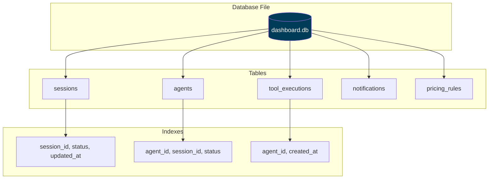

**Database Location:**
- Development: `./data/dashboard.db`
- Production: `/var/lib/agent-dashboard/dashboard.db` (configurable via `DASHBOARD_DB_PATH`)

---

## Schema Diagram

### Entity-Relationship Diagram

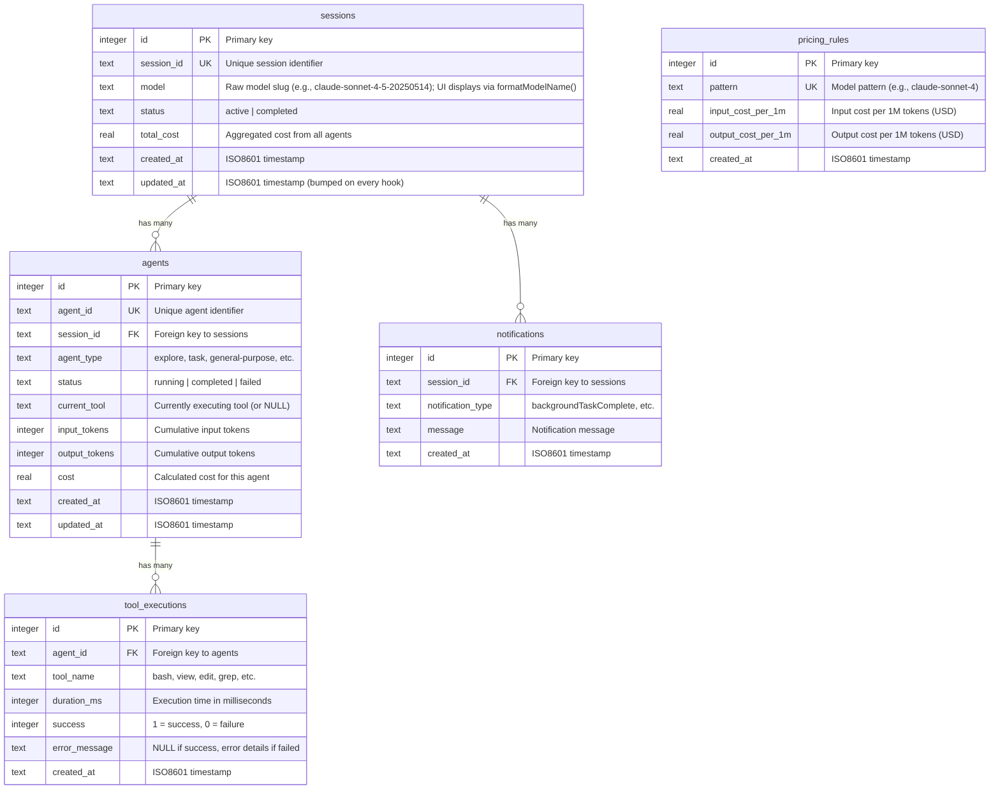

### Relationship Cardinality

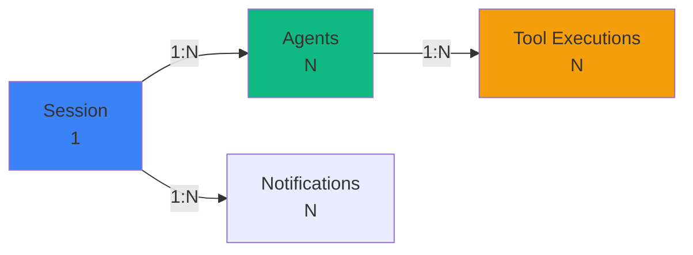

---

## Table Definitions

### sessions

Tracks Claude Code sessions (one per CLI invocation or background task). Schema mirrors `server/db.js`.

```sql
CREATE TABLE sessions (
    id TEXT PRIMARY KEY,                                              -- UUID from Claude Code
    name TEXT,
    status TEXT NOT NULL DEFAULT 'active'
        CHECK (status IN ('active','completed','error','abandoned')),
    cwd TEXT,
    model TEXT,
    started_at TEXT NOT NULL DEFAULT (strftime('%Y-%m-%dT%H:%M:%fZ','now')),
    ended_at TEXT,
    metadata TEXT,
    updated_at TEXT NOT NULL DEFAULT (strftime('%Y-%m-%dT%H:%M:%fZ','now')),
    awaiting_input_since TEXT,                                        -- NULL unless Waiting
    transcript_path TEXT                                              -- absolute path to JSONL transcript
);
```

**Columns:**

| Column | Type | Nullable | Description |
|--------|------|----------|-------------|
| `id` | TEXT | NO | Session UUID (assigned by Claude Code) |
| `name` | TEXT | YES | Human-readable label. Synced from the transcript title by `routes/hooks.js` (and the 15 s watchdog) on every event: the `custom-title` line (`/rename`, `claude -n`, picker `Ctrl+R`) always wins, otherwise the auto-generated `ai-title` fills a placeholder/auto name. Falls back to `Session <id8>` |
| `status` | TEXT | NO | `active`, `completed`, `error`, or `abandoned` (CHECK-constrained) |
| `cwd` | TEXT | YES | Working directory the CLI was launched from |
| `model` | TEXT | YES | Claude model ID (e.g. `claude-opus-4-7`) |
| `started_at` | TEXT | NO | ISO 8601 timestamp |
| `ended_at` | TEXT | YES | ISO 8601 timestamp on terminal transition |
| `metadata` | TEXT | YES | JSON blob for extras (turn duration totals, thinking blocks, …) |
| `updated_at` | TEXT | NO | Bumped on every event for staleness detection |
| `awaiting_input_since` | TEXT | YES | ISO 8601 stamp set when the session is **Waiting** (Stop, SessionStart, permission Notification, or watchdog user-interrupt/Esc recovery). NULL otherwise |
| `transcript_path` | TEXT | YES | Absolute path to the session's JSONL transcript. Written by `routes/hooks.js` on the first event that carries it (subsequent events no-op via a SQL guard) and read by the periodic compaction sweep — so the sweep touches only active session rows instead of scanning the entire `events` table for `json_extract(data,'$.transcript_path')`. Backfilled once from `events` by the `db.js` migration |

**Constraints:**
- `status` must be one of the four enum values
- `awaiting_input_since` is ignored on non-`active` sessions for UI bucketing

**Lifecycle:**

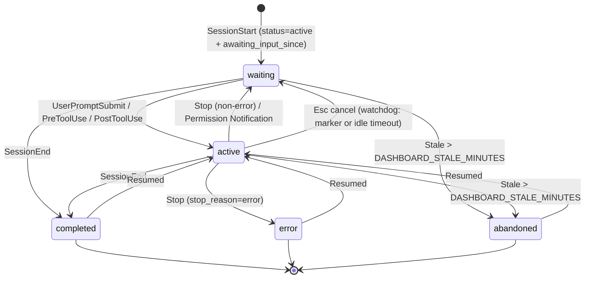

---

### agents

Tracks main agents and subagents within a session. Main agents have id `${session_id}-main`; subagents get a fresh UUID.

```sql
CREATE TABLE agents (
    id TEXT PRIMARY KEY,
    session_id TEXT NOT NULL,
    name TEXT NOT NULL,
    type TEXT NOT NULL DEFAULT 'main' CHECK (type IN ('main','subagent')),
    subagent_type TEXT,
    status TEXT NOT NULL DEFAULT 'idle'
        CHECK (status IN ('idle','connected','working','completed','error')),
    task TEXT,
    current_tool TEXT,
    started_at TEXT NOT NULL DEFAULT (strftime('%Y-%m-%dT%H:%M:%fZ','now')),
    ended_at TEXT,
    parent_agent_id TEXT,
    metadata TEXT,
    updated_at TEXT NOT NULL DEFAULT (strftime('%Y-%m-%dT%H:%M:%fZ','now')),
    awaiting_input_since TEXT,                                        -- main-agent waiting flag
    FOREIGN KEY (session_id) REFERENCES sessions(id) ON DELETE CASCADE,
    FOREIGN KEY (parent_agent_id) REFERENCES agents(id) ON DELETE SET NULL
);
```

**Columns:**

| Column | Type | Nullable | Description |
|--------|------|----------|-------------|
| `id` | TEXT | NO | UUID (subagents) or `${session_id}-main` (main agent) |
| `session_id` | TEXT | NO | FK to `sessions.id`, cascades on delete |
| `name` | TEXT | NO | Display label (e.g. `Main Agent - {session name}` or subagent description) |
| `type` | TEXT | NO | `main` or `subagent` |
| `subagent_type` | TEXT | YES | `Explore`, `general-purpose`, `code-review`, `compaction`, … |
| `status` | TEXT | NO | `idle`, `connected`, `working`, `completed`, `error` (CHECK-constrained). The dashboard's **Waiting** badge is the UI overlay produced by `awaiting_input_since`; it is not a persisted status |
| `task` | TEXT | YES | Subagent prompt / brief |
| `current_tool` | TEXT | YES | Tool currently running (cleared on `PostToolUse`) |
| `parent_agent_id` | TEXT | YES | FK to the spawning agent for nested subagent trees (`ON DELETE SET NULL`). Set to the main agent at insert, then repointed to the true spawner by `reconcileSubagentParents` from each subagent transcript's Task tool result (`toolUseResult.agentId`), so subagents-of-subagents nest correctly instead of flattening under main |
| `metadata` | TEXT | YES | JSON blob for extras. For subagents it carries `model` (the subagent's own model, issue #185) and `tokens` — an array of per-agent token buckets parsed from the subagent's transcript. The agent-list endpoints price `tokens` at the current rates to attach a per-agent `cost` (so a subagent card shows its OWN cost, not the session total). Empty `[]` means the subagent did no billable work; absent means its transcript wasn't available to parse |
| `awaiting_input_since` | TEXT | YES | Mirrors the parent session's flag for the main agent. NULL on subagents |

**Lifecycle:**

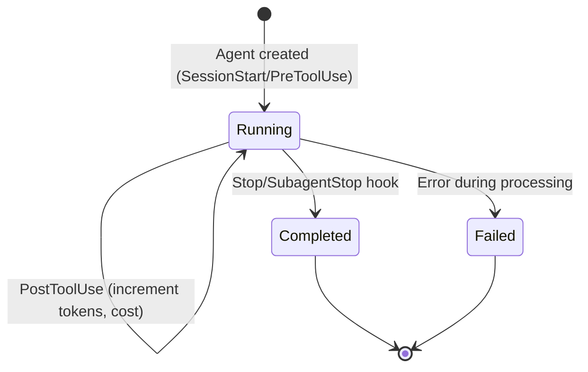

**current_tool Behavior:**
- Set to tool name on `PreToolUse` hook (e.g., `"bash"`, `"view"`)
- Cleared to `NULL` on `PostToolUse` hook
- Used to show real-time tool execution in UI

---

### tool_executions

Records each tool call made by agents.

```sql
CREATE TABLE tool_executions (
    id INTEGER PRIMARY KEY AUTOINCREMENT,
    agent_id TEXT NOT NULL,
    tool_name TEXT NOT NULL,
    duration_ms INTEGER,
    success INTEGER DEFAULT 1,
    error_message TEXT,
    created_at TEXT DEFAULT (datetime('now')),
    FOREIGN KEY (agent_id) REFERENCES agents(agent_id)
);
```

**Columns:**

| Column | Type | Nullable | Description |
|--------|------|----------|-------------|
| `id` | INTEGER | NO | Auto-increment primary key |
| `agent_id` | TEXT | NO | Foreign key to `agents.agent_id` |
| `tool_name` | TEXT | NO | Tool name (`bash`, `view`, `edit`, `grep`, etc.) |
| `duration_ms` | INTEGER | YES | Execution time in milliseconds |
| `success` | INTEGER | NO | 1 = success, 0 = failure |
| `error_message` | TEXT | YES | NULL if success, error details if failed |
| `created_at` | TEXT | NO | ISO8601 timestamp of execution |

**Common Tool Names:**
- `bash` - Shell command execution
- `view` - File/directory viewing
- `edit` - File editing
- `grep` - Code search
- `glob` - File pattern matching
- `task` - Sub-agent invocation
- `sql` - SQLite query execution

**Duration Distribution:**

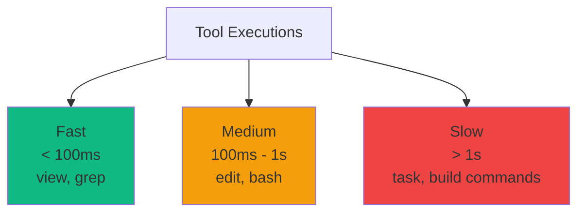

---

### notifications

Stores system notifications from Claude Code.

```sql
CREATE TABLE notifications (
    id INTEGER PRIMARY KEY AUTOINCREMENT,
    session_id TEXT NOT NULL,
    notification_type TEXT NOT NULL,
    message TEXT,
    created_at TEXT DEFAULT (datetime('now')),
    FOREIGN KEY (session_id) REFERENCES sessions(session_id)
);
```

**Columns:**

| Column | Type | Nullable | Description |
|--------|------|----------|-------------|
| `id` | INTEGER | NO | Auto-increment primary key |
| `session_id` | TEXT | NO | Foreign key to `sessions.session_id` |
| `notification_type` | TEXT | NO | Type of notification |
| `message` | TEXT | YES | Notification message content |
| `created_at` | TEXT | NO | ISO8601 timestamp |

**Common Notification Types:**
- `backgroundTaskComplete` - Background agent finished
- `errorOccurred` - Error during execution
- `systemMessage` - General system message

---

### model_pricing

Per-model pricing rules for cost calculation, keyed by `model_pattern` (a SQL-style glob; `%` matches any characters). Rates are per **million** tokens (USD).

```sql
CREATE TABLE model_pricing (
    model_pattern TEXT PRIMARY KEY,
    display_name TEXT NOT NULL,
    input_per_mtok REAL NOT NULL DEFAULT 0,
    output_per_mtok REAL NOT NULL DEFAULT 0,
    cache_read_per_mtok REAL NOT NULL DEFAULT 0,
    cache_write_per_mtok REAL NOT NULL DEFAULT 0,
    cache_write_1h_per_mtok REAL NOT NULL DEFAULT 0,   -- 1h-ephemeral cache-write tier
    fast_input_per_mtok REAL NOT NULL DEFAULT 0,       -- fast-mode premium rates
    fast_output_per_mtok REAL NOT NULL DEFAULT 0,
    -- Time-limited introductory (promo) rates. When intro_until is set, usage on
    -- or before that date (YYYY-MM-DD) is priced at the intro_* rates and usage
    -- after it at the standard rates. All 0 / NULL = no promo.
    intro_input_per_mtok REAL NOT NULL DEFAULT 0,
    intro_output_per_mtok REAL NOT NULL DEFAULT 0,
    intro_cache_read_per_mtok REAL NOT NULL DEFAULT 0,
    intro_cache_write_per_mtok REAL NOT NULL DEFAULT 0,
    intro_cache_write_1h_per_mtok REAL NOT NULL DEFAULT 0,
    intro_until TEXT,                                   -- promo cutoff YYYY-MM-DD, or NULL
    updated_at TEXT NOT NULL DEFAULT (strftime('%Y-%m-%dT%H:%M:%fZ','now'))
);
```

**Columns (highlights):**

| Column | Type | Nullable | Description |
|--------|------|----------|-------------|
| `model_pattern` | TEXT | NO | Primary key. SQL-style glob (e.g. `claude-opus-4-7%`, `claude-%-haiku`). Rules are matched longest-pattern-first |
| `display_name` | TEXT | NO | Human-readable model name shown in Settings |
| `input_per_mtok` / `output_per_mtok` | REAL | NO | Standard input / output rate per 1M tokens |
| `cache_read_per_mtok` / `cache_write_per_mtok` / `cache_write_1h_per_mtok` | REAL | NO | Cache read + 5m/1h cache-write rates |
| `fast_input_per_mtok` / `fast_output_per_mtok` | REAL | NO | Fast-mode premium rates (0 = no premium) |
| `intro_*_per_mtok` | REAL | NO | Introductory (promo) rates, mirroring the standard fields |
| `intro_until` | TEXT | YES | Promo cutoff `YYYY-MM-DD`. Usage on/before it uses the intro rates; NULL = no promo. Editable per-rule in Settings |
| `updated_at` | TEXT | NO | ISO8601 timestamp of the last edit |

Standard rates and intro rates are edited independently: the pricing update path writes intro columns only when the caller sends intro fields, so a standard-rate edit never disturbs a promo (and vice versa). Clearing `intro_until` also zeroes the intro rates.

**Example default rule (Claude Sonnet 5, with its launch promo):**

| Pattern | Input | Output | Intro Input | Intro Output | Intro Until |
|---------|-------|--------|-------------|--------------|-------------|
| `claude-sonnet-5%` | $3.00 | $15.00 | $2.00 | $10.00 | `2026-08-31` |

---

### accounts / account_swaps (multi-account, Phase K)

Populated read-only by `server/lib/claude-swap.js`, which observes claude-swap's
`~/.claude-swap-backup/autoswitch_state.json`. Empty when claude-swap isn't
installed, so single-account setups are unaffected.

```sql
CREATE TABLE accounts (
  id          TEXT PRIMARY KEY,   -- claude-swap account key (email/label)
  label       TEXT,
  active      INTEGER NOT NULL DEFAULT 0,  -- 1 = account currently in use
  first_seen  TEXT NOT NULL DEFAULT (strftime('%Y-%m-%dT%H:%M:%fZ','now')),
  last_active TEXT,
  resets_at   TEXT,               -- best-effort per-account window reset (ISO)
  metadata    TEXT
);

CREATE TABLE account_swaps (
  id           INTEGER PRIMARY KEY AUTOINCREMENT,
  from_account TEXT,              -- NULL for the first observation
  to_account   TEXT NOT NULL,
  reason       TEXT,
  created_at   TEXT NOT NULL DEFAULT (strftime('%Y-%m-%dT%H:%M:%fZ','now'))
);
```

`sessions` and `dashboard_runs` also gain a nullable `account_id` column
(migration-safe) tagging the account active at start time — best-effort
attribution; NULL for non-swap setups.

### scheduled_prompts (scheduled & chained prompts, Phase L)

Backs `server/lib/scheduler.js`. Each row is one deferred spawn or follow-up.
`target_opts` (spawn options / target runId) and trigger params are JSON so the
scheduler re-arms across restarts with no extra columns.

```sql
CREATE TABLE scheduled_prompts (
  id            TEXT PRIMARY KEY,
  label         TEXT,
  prompt        TEXT NOT NULL,
  target_kind   TEXT NOT NULL DEFAULT 'new_run',   -- 'new_run' | 'session_message'
  target_opts   TEXT NOT NULL DEFAULT '{}',        -- JSON spawn opts, or { runId }
  trigger_kind  TEXT NOT NULL DEFAULT 'at',        -- 'at' | 'on_run_complete'
  fire_at       TEXT,                              -- ISO time for trigger_kind='at'
  trigger_run_id TEXT,                             -- watched run for 'on_run_complete'
  status_filter TEXT NOT NULL DEFAULT 'any',       -- 'any' | 'success'
  status        TEXT NOT NULL DEFAULT 'pending'
                CHECK(status IN ('pending','fired','cancelled','failed')),
  chain_depth   INTEGER NOT NULL DEFAULT 0,        -- chaining guard
  late          INTEGER NOT NULL DEFAULT 0,        -- 1 = a missed 'at' time fired on boot
  fired_at      TEXT,
  result_run_id TEXT,                              -- run produced by the fire
  error         TEXT,
  created_at    TEXT NOT NULL DEFAULT (strftime('%Y-%m-%dT%H:%M:%fZ','now')),
  updated_at    TEXT NOT NULL DEFAULT (strftime('%Y-%m-%dT%H:%M:%fZ','now'))
);
```

---

### chats / chat_messages (multi-provider chat, Phase E)

Backs the Chat page (`server/routes/chat.js`). A `chats` conversation groups
ordered `chat_messages`. Additive + independent of every existing table. The
chat's `provider`/`model` are the last-used pick (the picker seeds from them);
each message also records the provider/model that produced it. `cc_session_id`
lets the Claude provider continue one Claude Code session across turns
(`--resume`). `image_path` is set only for generated-image messages (the file
lives under the data dir, served via `GET /api/chat/images/:file`).

```sql
CREATE TABLE chats (
  id            TEXT PRIMARY KEY,
  title         TEXT,                                -- auto-seeded from first user turn
  provider      TEXT,                                -- last-used chat provider
  model         TEXT,                                -- last-used model
  cc_session_id TEXT,                                -- Claude session id for --resume continuation
  created_at    TEXT NOT NULL DEFAULT (strftime('%Y-%m-%dT%H:%M:%fZ','now')),
  updated_at    TEXT NOT NULL DEFAULT (strftime('%Y-%m-%dT%H:%M:%fZ','now'))
);

CREATE TABLE chat_messages (
  id         TEXT PRIMARY KEY,
  chat_id    TEXT NOT NULL,                          -- FK → chats.id, ON DELETE CASCADE
  role       TEXT NOT NULL CHECK(role IN ('user','assistant','system')),
  provider   TEXT,
  model      TEXT,
  content    TEXT NOT NULL DEFAULT '',
  image_path TEXT,                                   -- generated-image filename, or NULL
  created_at TEXT NOT NULL DEFAULT (strftime('%Y-%m-%dT%H:%M:%fZ','now')),
  FOREIGN KEY (chat_id) REFERENCES chats(id) ON DELETE CASCADE
);
```

---

### projects / project_paths (Phase F)

Backs the Projects page (`server/routes/projects.js`, `server/lib/projects.js`)
— a dashboard-native organizing dimension over sessions, dashboard-spawned
runs, and chats, **deliberately separate from Claude.ai's own "Projects"
feature**. A project may span multiple repos, so path-matching lives in a
one-to-many `project_paths` table rather than a single column on `projects`.
`status` doubles as the archive flag — `"done"` means archived, there is no
separate archived boolean/column.

```sql
CREATE TABLE projects (
  id          TEXT PRIMARY KEY,
  name        TEXT NOT NULL,
  description TEXT,
  status      TEXT NOT NULL DEFAULT 'active'
              CHECK(status IN ('active','paused','done')),
  repo_path   TEXT,                                  -- first/primary repo path, or NULL
  notes_dir   TEXT,                                  -- reserved for Phase G Notes linkage
  created_at  TEXT NOT NULL DEFAULT (strftime('%Y-%m-%dT%H:%M:%fZ','now')),
  updated_at  TEXT NOT NULL DEFAULT (strftime('%Y-%m-%dT%H:%M:%fZ','now'))
);

CREATE TABLE project_paths (
  id         TEXT PRIMARY KEY,
  project_id TEXT NOT NULL,                          -- FK → projects.id, ON DELETE CASCADE
  repo_path  TEXT NOT NULL,
  created_at TEXT NOT NULL DEFAULT (strftime('%Y-%m-%dT%H:%M:%fZ','now')),
  FOREIGN KEY (project_id) REFERENCES projects(id) ON DELETE CASCADE
);
```

Additive nullable `project_id` columns (no FK — same convention as
`sessions.account_id`, Phase K) on:

- `sessions` — set once, right after a hook-ingested session is created, by
  matching its `cwd` against the longest matching `project_paths` prefix
  (path-boundary aware: `/repo-2` never matches a registered `/repo`).
- `dashboard_runs` — resolved once at spawn time in `run-spawner.js` (an
  explicit `projectId` on `POST /api/run` wins over the cwd match) and
  persisted by `dashboard-runs.js`.
- `chats` — **explicit-only**, since a chat conversation has no cwd. Set via
  an optional `projectId` field on `POST`/`PATCH /api/chat/chats/:id`.

Adding a `project_paths` row re-scans (`rescanUnassociated()`) every existing
session/run with a cwd but no project yet, so registering a path after the
fact retroactively tags prior history too, not just future activity. Deleting
a project nulls `project_id` on every session/run/chat that referenced it
before removing the row — the project is an organizing label, not the system
of record for that activity.

---

### notes / notes_fts + app_settings + brain_calls + project_pulse (Phase G)

Notes are **markdown files on disk** (default `~/JarvisNotes`, overridable via the
`JARVIS_NOTES_DIR` env var or the `app_settings` `notes_dir` key). The files are
the system of record — `notes` is a rebuildable index an `fs.watch` watcher keeps
in sync (`server/lib/notes.js`), so an edit made in Obsidian/anywhere shows up.
`notes_fts` is an FTS5 virtual table for full-text search, created guarded (a
stripped SQLite without FTS5 falls back to a LIKE scan; see `NOTES_FTS_OK` in
`db.js`). `app_settings` is a tiny generic key/value store (no secrets — those
stay in `server/config/providers.json`). `brain_calls` logs every mini-Jarvis
routing decision (Phase G2). `project_pulse` holds one recomputed-daily row per
project for the working/neglected/completed tracker.

```sql
CREATE TABLE app_settings (
  key        TEXT PRIMARY KEY,
  value      TEXT,
  updated_at TEXT NOT NULL DEFAULT (strftime('%Y-%m-%dT%H:%M:%fZ','now'))
);

CREATE TABLE notes (
  id         TEXT PRIMARY KEY,                       -- mirrors the file's frontmatter id
  path       TEXT NOT NULL UNIQUE,                   -- absolute file path (stable identity)
  title      TEXT,
  tags       TEXT NOT NULL DEFAULT '[]',             -- JSON array string
  project_id TEXT,                                   -- optional linkage (Phase F)
  source     TEXT,                                   -- manual | dump | voice
  excerpt    TEXT,
  mtime      TEXT,
  created_at TEXT,
  updated_at TEXT
);

CREATE VIRTUAL TABLE notes_fts USING fts5(note_id UNINDEXED, title, tags, body);

CREATE TABLE brain_calls (
  id         TEXT PRIMARY KEY,
  task_class TEXT,                                   -- simple | standard | complex
  provider   TEXT,                                   -- gemini | ollama | claude | (null)
  intent     TEXT,                                   -- reformat | chat | voice | ...
  ok         INTEGER NOT NULL DEFAULT 1,
  fell_back  INTEGER NOT NULL DEFAULT 0,
  latency_ms INTEGER,
  tokens     INTEGER,
  error      TEXT,
  created_at TEXT NOT NULL DEFAULT (strftime('%Y-%m-%dT%H:%M:%fZ','now'))
);

CREATE TABLE project_pulse (
  project_id          TEXT PRIMARY KEY,
  state               TEXT,                          -- active | neglected | idle | paused | completed
  summary             TEXT,
  days_since_activity INTEGER,
  open_todos          INTEGER,
  last_activity_at    TEXT,
  computed_at         TEXT NOT NULL DEFAULT (strftime('%Y-%m-%dT%H:%M:%fZ','now'))
);
```

The `notes.project_id` linkage is best-effort/explicit (frontmatter `project`).
A project's pulse row is deleted when the project is deleted. All Phase G schema
is additive and migration-safe.

### skill_runs (tap-to-run automations, Phase H)

Skill **definitions** are markdown+frontmatter files on disk (default
`~/JarvisSkills`, overridable via `JARVIS_SKILLS_DIR` or the `app_settings`
`skills_dir` key) — there is deliberately **no table for them** (unlike
`notes`, there's no index to rebuild; the library is small enough that
`server/lib/skills/store.js` reads the directory straight off disk on every
list/get). `skill_runs` is execution **history** only: one row per run, with
per-step progress appended to `steps` as the engine works through the
pipeline, so the Skills page can render live progress and a full history
afterward.

```sql
CREATE TABLE skill_runs (
  id          TEXT PRIMARY KEY,
  skill_id    TEXT NOT NULL,                         -- matches the frontmatter/derived id, not a FK (the file may be gone)
  skill_name  TEXT,                                  -- denormalized so history survives a rename/delete
  trigger     TEXT NOT NULL DEFAULT 'manual'          -- manual | voice | phone | schedule
              CHECK(trigger IN ('manual','voice','phone','schedule')),
  status      TEXT NOT NULL DEFAULT 'running'
              CHECK(status IN ('running','success','failed','cancelled')),
  params      TEXT NOT NULL DEFAULT '{}',             -- JSON — the params the run was invoked with
  steps       TEXT NOT NULL DEFAULT '[]',             -- JSON array: [{index,type,label,status,output,error,startedAt,finishedAt}]
  error       TEXT,
  started_at  TEXT NOT NULL DEFAULT (strftime('%Y-%m-%dT%H:%M:%fZ','now')),
  finished_at TEXT
);
```

`trigger` matters for the safety model, not just provenance: `voice`,
`phone`, and `schedule` triggers can only ever fire a skill whose frontmatter
sets `confirm: none` — enforced in `server/lib/skills/engine.js`, not derivable
from this table alone. A row left `status = 'running'` after an unclean server
exit is flipped to `failed` on the next boot (`reconcileOrphanRuns()`) since
there's no way to resume in-process step execution across a restart. All
Phase H schema is additive and migration-safe.

---

### github_cache (dev-workflow panel, Phase I)

The GitHub overview (open PRs, review requests, CI status, recent issues across
the configured repos) is fetched from the `gh` CLI or the REST API and cached as
a **single-row JSON snapshot** so `GET /api/github` serves instantly and the
data survives a restart. It is a cache, not a source of truth: the watched-repo
list + PAT live in `server/config/github.json` (gitignored), not the DB.

```sql
CREATE TABLE github_cache (
  id          INTEGER PRIMARY KEY CHECK(id = 1),   -- always one row
  data        TEXT NOT NULL DEFAULT '{}',          -- JSON — the full overview object
  fingerprint TEXT,                                -- stable hash of the user-visible surface
  fetched_at  TEXT,
  error       TEXT                                 -- last fetch error (overview still served)
);
```

The poller (on the shared Phase-L scheduler) upserts row 1 each cycle and
broadcasts `github_updated` only when `fingerprint` changes. Additive and
migration-safe; with GitHub unconfigured the table simply stays empty.

---

## Indexes

### sessions Indexes

```sql
CREATE INDEX idx_sessions_session_id ON sessions(session_id);
CREATE INDEX idx_sessions_status ON sessions(status);
CREATE INDEX idx_sessions_updated_at ON sessions(updated_at DESC);

-- Partial index covering only the rows the periodic compaction sweep reads:
-- active sessions with a known transcript_path. Writes to other sessions skip
-- the index entirely, so the maintenance cost stays bounded by the small set
-- of live sessions.
CREATE INDEX idx_sessions_active_tp
    ON sessions(status, transcript_path)
    WHERE status='active' AND transcript_path IS NOT NULL;
```

**Query Patterns:**
- `SELECT * FROM sessions WHERE session_id = ?` - Primary key lookup
- `SELECT * FROM sessions WHERE status = 'active'` - Filter by status
- `SELECT * FROM sessions ORDER BY updated_at DESC LIMIT 50` - Recent sessions
- `SELECT id, transcript_path FROM sessions WHERE status='active' AND transcript_path IS NOT NULL ORDER BY updated_at DESC` — periodic compaction sweep (covered by the partial index above)

### agents Indexes

```sql
CREATE INDEX idx_agents_agent_id ON agents(agent_id);
CREATE INDEX idx_agents_session_id ON agents(session_id);
CREATE INDEX idx_agents_status ON agents(status);
```

**Query Patterns:**
- `SELECT * FROM agents WHERE agent_id = ?` - Primary key lookup
- `SELECT * FROM agents WHERE session_id = ?` - All agents for session
- `SELECT * FROM agents WHERE status = 'running'` - Active agents

### events Indexes

```sql
-- Keeps the per-tool-event dedup used by subagent import an index seek instead
-- of a full events scan. importSubagentFromJsonl checks
-- `... WHERE agent_id = ? AND event_type = ? AND data LIKE '%"tool_use_id":"X"%'`
-- before inserting; on a subagent-heavy re-import this drops a large sweep from
-- tens of seconds to sub-second.
CREATE INDEX idx_events_agent_type ON events(agent_id, event_type);
```

### tool_executions Indexes

```sql
CREATE INDEX idx_tools_agent_id ON tool_executions(agent_id);
CREATE INDEX idx_tools_created_at ON tool_executions(created_at DESC);
```

**Query Patterns:**
- `SELECT * FROM tool_executions WHERE agent_id = ?` - All tools for agent
- `SELECT * FROM tool_executions ORDER BY created_at DESC LIMIT 100` - Recent tools

### notifications Indexes

```sql
CREATE INDEX idx_notifications_session_id ON notifications(session_id);
```

**Query Patterns:**
- `SELECT * FROM notifications WHERE session_id = ?` - All notifications for session

---

## Migrations

### Schema Versioning

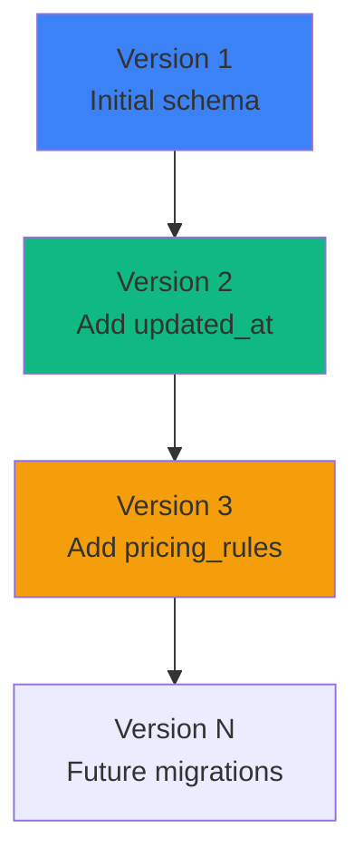

### Migration Strategy

```javascript
// db.js - Schema versioning
const SCHEMA_VERSION = 3;

function runMigrations() {
  const currentVersion = db.pragma('user_version', { simple: true });
  
  if (currentVersion < 1) {
    // Initial schema
    db.exec(`
      CREATE TABLE sessions (...);
      CREATE TABLE agents (...);
      -- etc.
    `);
    db.pragma('user_version = 1');
  }
  
  if (currentVersion < 2) {
    // Add updated_at column
    db.exec(`ALTER TABLE sessions ADD COLUMN updated_at TEXT DEFAULT (datetime('now'))`);
    db.pragma('user_version = 2');
  }
  
  if (currentVersion < 3) {
    // Add pricing_rules table
    db.exec(`CREATE TABLE pricing_rules (...)`);
    db.pragma('user_version = 3');
  }
}
```

### Migration Workflow

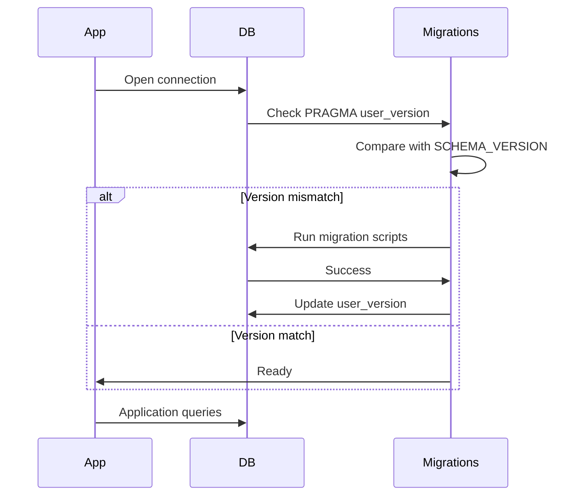

---

## Query Patterns

### Common Queries

#### List Recent Sessions

```sql
SELECT 
  s.*,
  COUNT(DISTINCT a.id) as agent_count,
  COUNT(DISTINCT t.id) as tool_count
FROM sessions s
LEFT JOIN agents a ON s.session_id = a.session_id
LEFT JOIN tool_executions t ON a.agent_id = t.agent_id
GROUP BY s.id
ORDER BY s.updated_at DESC
LIMIT 50;
```

**Performance:** ~5-10ms (with indexes)

#### Get Session with Agents

```sql
SELECT * FROM sessions WHERE session_id = 'sess_abc123';
SELECT * FROM agents WHERE session_id = 'sess_abc123';
```

**Performance:** ~1-2ms per query

#### Get Agent Tools

```sql
SELECT * FROM tool_executions 
WHERE agent_id = 'agent_xyz789'
ORDER BY created_at DESC;
```

**Performance:** ~2-5ms

#### Calculate Total Cost

```sql
SELECT 
  SUM(cost) as total_cost
FROM agents
WHERE session_id = 'sess_abc123';
```

**Performance:** ~1-2ms

### Query Optimization

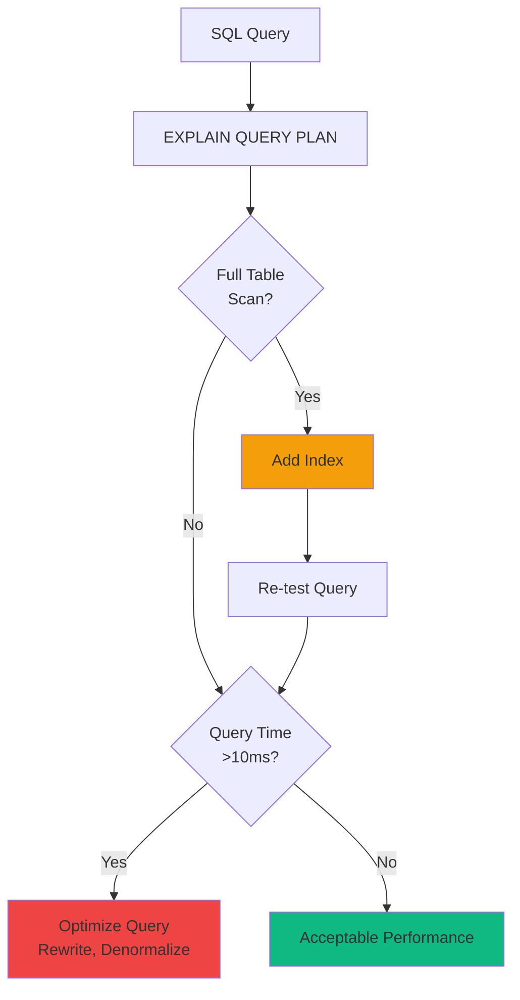

---

## Performance Optimization

### SQLite Pragmas

```javascript
// db.js - Performance tuning
db.pragma('journal_mode = WAL');        // Write-Ahead Logging
db.pragma('synchronous = NORMAL');      // Faster writes (safe with WAL)
db.pragma('cache_size = -64000');       // 64MB cache
db.pragma('temp_store = MEMORY');       // Temp tables in memory
db.pragma('mmap_size = 30000000000');   // Memory-mapped I/O (30GB)
db.pragma('page_size = 4096');          // Optimal page size
```

### Prepared Statements

```javascript
// db.js - Prepared statements prevent SQL injection + optimize performance
const stmts = {
  findSession: db.prepare('SELECT * FROM sessions WHERE session_id = ?'),
  createSession: db.prepare('INSERT INTO sessions (session_id, model) VALUES (?, ?)'),
  updateSession: db.prepare('UPDATE sessions SET status = ?, total_cost = ? WHERE session_id = ?'),
  touchSession: db.prepare("UPDATE sessions SET updated_at = datetime('now') WHERE session_id = ?")
};

// Usage
const session = stmts.findSession.get('sess_abc123');
stmts.touchSession.run('sess_abc123');
```

### Transaction Batching

```javascript
// Batch multiple writes in a transaction
const insertMany = db.transaction((tools) => {
  for (const tool of tools) {
    stmts.createToolExecution.run(tool.agent_id, tool.tool_name, tool.duration_ms);
  }
});

insertMany([
  { agent_id: 'agent_1', tool_name: 'bash', duration_ms: 100 },
  { agent_id: 'agent_1', tool_name: 'view', duration_ms: 50 },
  // ... more tools
]);
```

### Performance Benchmarks

| Operation | Without Optimization | With Optimization | Improvement |
|-----------|---------------------|-------------------|-------------|
| Session list (50) | 25ms | 5ms | 5x faster |
| Hook processing | 15ms | 2ms | 7.5x faster |
| Batch insert (100 tools) | 500ms | 50ms | 10x faster |

---

## Data Integrity

### Foreign Key Constraints

```sql
-- Enabled by default in db.js
PRAGMA foreign_keys = ON;
```

**Constraint Enforcement:**

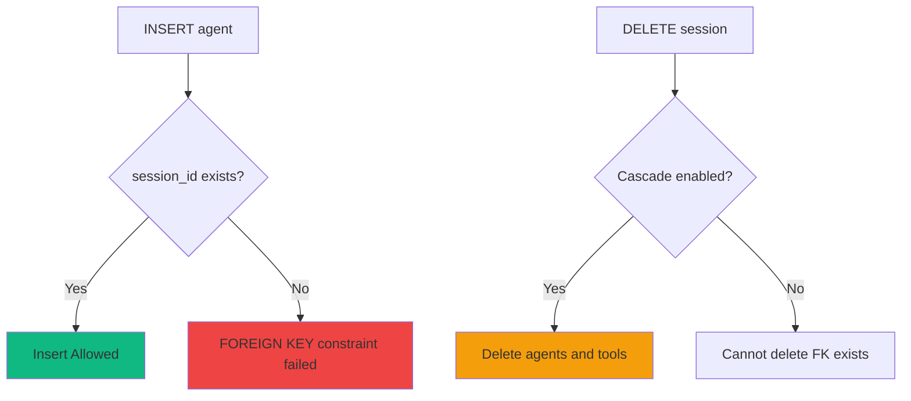

### Data Validation

```javascript
// Validate before insert
function validateSession(session) {
  if (!session.session_id) throw new Error('session_id required');
  if (session.total_cost < 0) throw new Error('total_cost must be >= 0');
  if (!['active', 'completed'].includes(session.status)) {
    throw new Error('Invalid status');
  }
}
```

---

## Backup Strategies

### Online Backup (Recommended)

```sql
-- Using VACUUM INTO (SQLite 3.27+)
VACUUM INTO '/backups/dashboard_20240318.db';
```

### Offline Backup

```bash
#!/bin/bash
# Stop application
systemctl stop agent-dashboard

# Copy database file
cp /var/lib/agent-dashboard/dashboard.db /backups/dashboard_$(date +%Y%m%d).db

# Start application
systemctl start agent-dashboard
```

### Backup Schedule

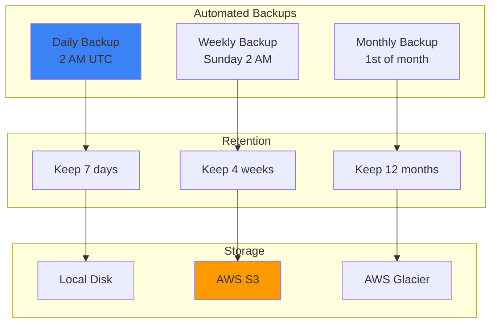

---

## Summary

The database schema provides:

- ✅ **Normalized design** - Minimal redundancy, clear relationships
- ✅ **Performance optimized** - Indexes, prepared statements, WAL mode
- ✅ **Data integrity** - Foreign keys, constraints, transactions
- ✅ **Migration support** - Schema versioning with PRAGMA user_version
- ✅ **Comprehensive indexing** - Fast queries for common access patterns
- ✅ **Backup strategies** - Online + offline backup options

For API usage, see [docs/API.md](./API.md).
